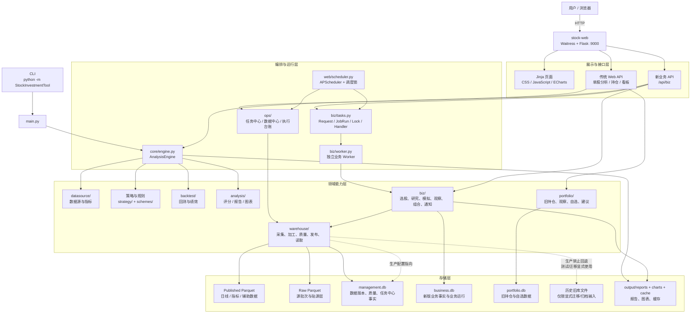
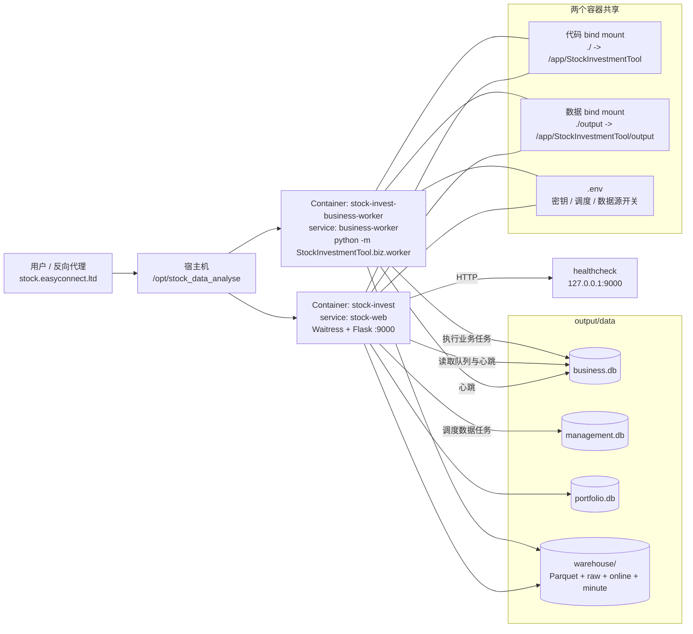
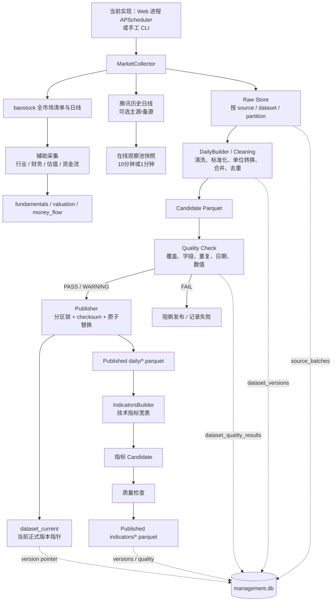
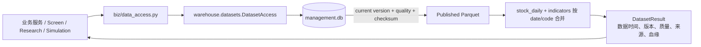
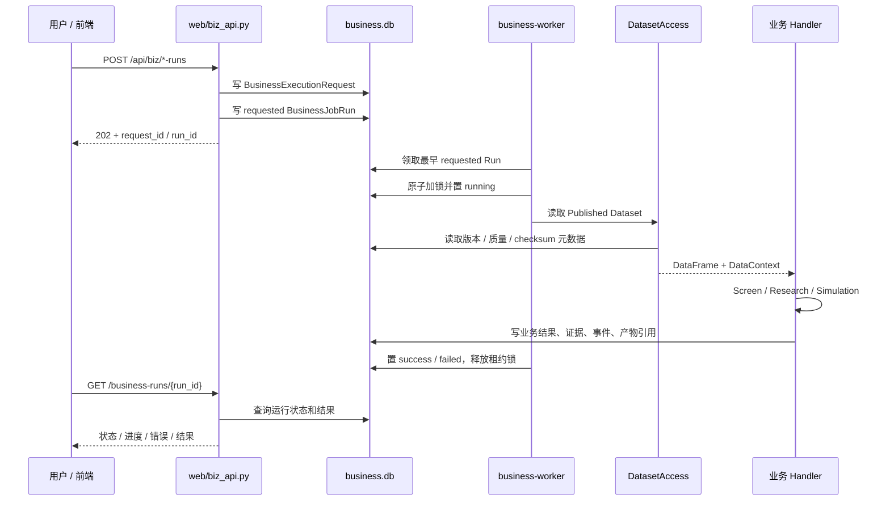
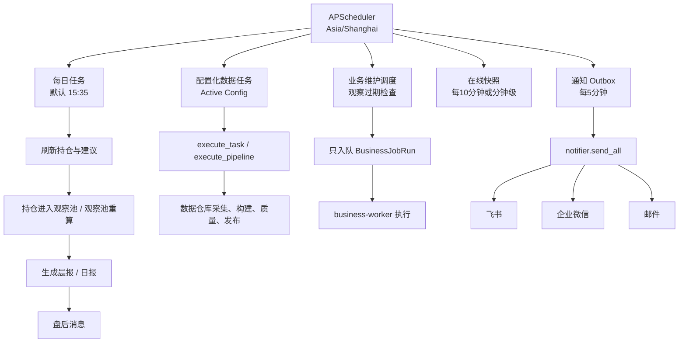

# StockInvestmentTool 当前架构设计

> 梳理日期：2026-09-01  
> 依据：当前代码、`docker-compose.yml`、运行配置及现状文档。  
> 本文描述当前实现，不等同于各专项设计文档中的目标架构。

## 1. 架构概况

StockInvestmentTool 当前是一个面向 A 股投资分析的单仓库 Python 应用，采用“Web 看板 + CLI + 数据仓库 + 业务任务 Worker”的组合形态：

- **访问入口**：Flask Web 应用提供页面、传统分析 API、新业务平面 API；`main.py` 提供 CLI。
- **分析核心**：`core/engine.py` 是 CLI 与 Web 共用的单股分析管线，串联行情、指标、估值、策略、回测、LLM、报告和图表。
- **策略体系**：策略方案由 YAML 描述，既有 v4.5 分批买入/止盈回测链路，也有 V6 状态机和注册表派发链路，当前仍是双代策略并存。
- **数据平面**：全市场数据采用 Raw/加工/Published 的分区数据仓库，主要落 Parquet；管理元数据、数据版本、质量和当前指针落 SQLite；DuckDB 用于按需扫描 Parquet。
- **业务平面**：新版选股、研究、模拟、观察、组合、通知和日报通过 `business.db` 保存业务事实，并通过统一 Request/JobRun/Handler 模型执行长任务。
- **运行平面**：`stock-web` 同时承载 HTTP、数据任务调度和部分旧的每日任务；`business-worker` 独立领取并执行业务任务。
- **部署形态**：Docker Compose 两个服务，共享代码 bind mount 和 `output/` 数据目录；Web 暴露 `9000` 端口。

整体判断：当前系统已经从“Web 进程直接编排所有逻辑”的早期形态演进到“数据平面与业务平面分离”的过渡架构，但旧持仓/任务台账和新业务库仍然共存，部分旧入口尚未完全切换。

## 2. 总体架构图



## 3. 生产部署拓扑



当前部署关键点：

- `stock-web` 的镜像启动命令是 `waitress-serve --call ... StockInvestmentTool.web.app:create_app`。
- `create_app()` 注册传统 Web 蓝图和 `/api/biz` 蓝图，并初始化 APScheduler。
- Web 与 Worker 共享 `output/`，因此业务队列、数据版本和 Parquet 文件可跨进程可见。
- `BUSINESS_WORKER_REQUIRED=1` 时，健康检查会把业务 Worker 心跳作为就绪条件之一。
- 代码目录是 bind mount，纯代码变更后生产生效方式是重启容器，不需要重新构建镜像。

## 4. 分层与模块职责

| 层 | 主要目录 | 当前职责 |
|---|---|---|
| 入口层 | `main.py`, `web/app.py` | CLI、页面路由、传统接口、分析任务状态、文件服务 |
| 新业务接口层 | `web/biz_api.py` | DTO 校验、创建业务请求、读取业务运行和结果，不直接读取 Parquet |
| 任务与治理层 | `biz/tasks.py`, `biz/worker.py`, `ops/` | 请求/运行状态机、数据库租约锁、心跳、任务台账、健康检查、备份和数据中心 |
| 分析编排层 | `core/engine.py` | 共用单股分析流程和结构化 `AnalysisResult` |
| 数据源层 | `datasource/`, `screener/`, `fundflow/` | baostock、AkShare、腾讯行情及资金流等外部数据适配 |
| 数据仓库层 | `warehouse/` | 增量采集、Raw、加工、质量检查、版本发布、Parquet 读取 |
| 策略与分析层 | `strategy/`, `backtest/`, `analysis/` | 买卖规则、风控、回测、绩效、评分、报告、图表 |
| 业务领域层 | `biz/` | Screen、Research、Simulation、Observation、Portfolio、Notification、Reporting |
| 旧业务能力层 | `portfolio/` | 旧持仓、自选、交易、建议、看板和晨报实现 |
| 持久化层 | SQLite / Parquet / 文件 | 业务事实、管理事实、行情分区、报告和缓存 |

## 5. 单股分析流程

CLI 和传统 Web 分析接口都会进入 `AnalysisEngine.analyze()`。Web 入口会将重型分析放到后台线程，并用内存状态与 `management.db` 中的 `web_analysis_tasks` 保存进度。

```mermaid
flowchart LR
    START[CLI 参数或 Web 分析请求] --> OPT[AnalysisOptions\n方案 / 股票类型 / 回测 / LLM]
    OPT --> REG[SchemeRegistry\n加载 schemes/*.yaml]
    REG --> FETCH[获取行情、基本面、分红]
    FETCH --> SRC{统一数据源}
    SRC -->|优先| DS[DataSource / Warehouse]
    SRC -->|失败或缺失| BS[baostock / AkShare 兜底]
    DS --> K[K线 DataFrame]
    BS --> K
    K --> IND[TechnicalIndicators\n均线、趋势、波动率、支撑压力]
    IND --> VAL[ValuationHelper\nPE 分位、股息锚、交叉验证]
    VAL --> BUY[策略买入计划\nRuleRegistry 或 MultiBuyStrategy]
    BUY --> BT{是否回测}
    BT -->|是| BACK[BacktestEngine\nv4.5 / V6 回测 + 参数优化]
    BT -->|否| OUT[结构化结果]
    BACK --> MET[PerformanceMetrics\n收益、回撤、夏普、胜率]
    MET --> OUT
    OUT --> CHART[ChartGenerator\nK线 / 回测 / 绩效图]
    OUT --> PROMPT{是否生成 Prompt / 调用 LLM}
    PROMPT -->|是| LLM[PromptBuilder + DeepSeekClient]
    PROMPT -->|否| REPORT[ReportGenerator]
    LLM --> REPORT
    CHART --> REPORT
    REPORT --> FILE[output/reports + output/charts]
    REPORT --> RESP[CLI 输出或 Web JSON]
```



> 下方描述的是当前实现，不是目标运行架构。文中出现的在线 fallback 属于尚未完成收口的旧正式入口，不代表目标生产架构允许 fallback。

当前特点：

- 方案配置已从代码中抽离到 YAML，规则执行部分正在注册表化。
- 行情数据在不同入口存在不同优先级：业务平面正式读取 Published Dataset；旧持仓监控的仓库优先、baostock 兜底以及传统单股分析缺失时回退，均属于尚未完成收口的旧正式入口，不是目标生产架构允许的 fallback。
- LLM 是可选步骤，失败不会阻断基础分析和报告生成。
- Web 对重型分析使用 `_heavy_task_lock`，同一进程内限制重型任务并发数为 1。

## 6. 数据仓库流水线

数据仓库按月分区，设计目标是在 2C2G 环境中避免全市场一次性载入内存。数据源按源独立写入 Raw，随后生成标准/派生数据并通过质量门禁发布。



业务读取路径：



`DatasetAccess` 默认要求 Published Dataset，校验当前版本、质量和文件 checksum。业务平面不直接选择数据源，也不直接读取 Raw 文件。

数据链模块边界以 [数据平台与可信数据链路设计](DATA_PIPELINE_V1_DESIGN.md#44-数据链模块角色与职责) 为准。当前实现中的 `DailyBuilder` 同时承担 Build 和清洗标准化职责：Raw 只保留源头字段原值，单位转换和历史数据推断在读取 Raw 生成 Candidate 时执行；Quality 和 Publish 不负责修复数据。

## 7. 新业务任务异步流程

新业务 API 对长任务采用“HTTP 只入队，Worker 执行”的模式。当前已注册的业务任务包括选股、研究、模拟、参数搜索、日报、观察过期处理、建议刷新、通知投递和健康检查；实际调度中目前至少明确接入了观察过期维护任务。



任务状态主链路：

```text
requested -> running -> success
                    -> partial_success
                    -> failed
                    -> cancelled
```

运行时由数据库租约锁避免同一任务范围重复执行；Worker 持续写心跳，启动时会回收 stale 运行。业务 API 返回 202 前会先完成请求和运行记录持久化。

## 8. 选股到观察再到建仓

新版业务域的设计重点是让候选来源、研究依据、模拟结果和真实成交可以追溯。真实交易不会作为普通后台任务执行，而是在工作流服务中以事务写入。

```mermaid
flowchart LR
    SCREEN[ScreenDefinition\n筛选条件版本] --> RUN[screen.run\n读取 Published 数据]
    RUN --> CAND[ScreenCandidate\n候选 + 条件结果 + data_as_of]
    CAND --> OBS[Observation\n记录来源与观察周期]
    OBS --> RESEARCH[research.run\n技术 / 基本面 / 估值 / 市场状态]
    RESEARCH --> DECISION[StrategyDecision\n策略版本 + 决策证据]
    DECISION --> SIM[simulation.run\nSimulationPlan / Run]
    SIM --> RESULT[模拟成交、事件、持仓批次、绩效]
    RESULT --> READY{观察状态\nready_for_entry?}
    READY -->|否| OBS
    READY -->|是| CONFIRM[人工确认建仓]
    CONFIRM --> ENTRY[BusinessWorkflowService.record_entry]
    ENTRY --> TXN[PositionCycle + Execution\nLot + CashLedger]
    TXN --> PROMOTE[Observation promoted]
```



这条链路主要落在 `business.db`，业务服务通过 Repository 读写，不把业务事实写入旧 `portfolio.db`。但旧 Web 页面和 CLI 仍直接使用 `portfolio/` 能力，因此当前系统存在新旧持仓域并存的迁移过渡。

## 9. 每日调度与通知



调度器具有两种执行边界：

- **数据任务**：由 Web 进程直接调用 `ops.task_execution` 和仓库流水线，运行事实主要进入 `management.db` 的旧/过渡任务表。
- **业务任务**：调度回调只创建 `business.db` 中的 Request/JobRun，由独立 Worker 执行。

这正是当前“任务中心与业务 Worker 已建立，但数据任务仍保留旧执行载体”的过渡状态。

## 10. 存储布局与事实边界

```text
output/
├── data/
│   ├── management.db          # 生产数据管理事实：任务、数据集、版本、质量、发布指针
│   ├── business.db            # 新业务事实：策略、筛选、研究、模拟、观察、组合、通知、日报
│   ├── portfolio.db           # 旧持仓/交易/自选/建议能力仍使用的 SQLite
│   ├── job_runs.db            # 历史迁移/对账/归档输入；生产新任务事实目标为 management.db
│   ├── warehouse/
│   │   ├── raw/               # 各外部源的贴源数据
│   │   ├── daily/             # Published 日线月分区 Parquet
│   │   ├── indicators/        # Published 指标月分区 Parquet
│   │   ├── fundamentals/      # 财务等辅助数据（正式读取需有 Published 版本）
│   │   ├── valuation/          # 估值数据
│   │   ├── online/             # 观察池低频快照
│   │   └── minute/             # 观察池分钟快照
│   └── legacy/                 # 仅存放显式迁移/备份/归档输入，不参与生产读取
├── reports/                   # Markdown/结构化报告
└── charts/                    # matplotlib/mplfinance 图表
```

当前事实边界：

| 存储 | 当前定位 | 使用方式 |
|---|---|---|
| `business.db` | 新业务事实库 | 新业务 API、业务 Worker、业务 Repository |
| `management.db` | 数据管理事实库 | Dataset Registry、版本、质量、Current、数据任务台账 |
| `portfolio.db` | 旧业务事实库 | 旧 CLI/Web 持仓、交易、自选和建议 |
| 旧任务台账文件 | 历史迁移/归档输入 | 生产任务事实统一在 `management.db`；旧文件不得被运行时写入 |
| 旧 Warehouse 元数据库 | 历史迁移/归档输入 | `Warehouse` 生产默认使用 `management.db`；旧文件不得被运行时读取 |
| Parquet | 数据事实文件 | Raw、标准化、Published 和派生数据按分区保存 |

## 11. 当前架构优点

- CLI 与传统 Web 单股分析共享 `AnalysisEngine`，减少两套分析口径分叉。
- 数据仓库采用月分区 Parquet、按需 DuckDB 查询和增量采集，适配低配置主机。
- Published Dataset 具备版本、质量、checksum、发布锁、当前指针和回滚信息。
- 新业务任务具备持久化请求、运行状态机、租约锁、Worker 心跳和重启恢复能力。
- 策略、任务和数据集逐步配置化，运行结果开始携带数据上下文和版本引用。
- Web、Worker 共享持久化目录，服务重启不会丢失 `output/` 数据。

## 12. 当前主要限制与风险

- **新旧业务平面并存**：新版 `business.db` 与旧 `portfolio.db` 同时存在，页面和 CLI 尚未完全统一到新业务模型。
- **数据任务运行角色尚未完全拆分**：生产管理事实已统一到 `management.db`，但 APScheduler 仍运行在 Web 进程，数据生产尚未全部迁移到独立 Data Worker。
- **旧文件最终归档尚未验收**：生产默认路径已不再使用旧元数据库；迁移、备份、测试和历史报告仍可保留旧名称，但必须明确为非运行时输入。
- **数据任务与业务任务执行模型不同**：业务任务由独立 Worker 执行；数据仓库任务仍由 Web 进程内调度器直接执行，Web 进程存在重任务资源压力。
- **策略实现双轨**：v4.5 与 V6.0 的规则、状态机和回测能力仍未完全统一到单一执行协议。
- **通知能力仍在演进**：已有 Outbox、去重和多渠道发送能力，但部分业务任务 handler 仍是基础实现或占位实现。
- **生产配置需关注认证开关**：当前 Compose 中显式设置 `STOCK_DISABLE_AUTH=1`，属于已授权的临时免登录配置，应纳入生产安全检查。
- **生产收口证据尚未完整**：`management.db` 已是生产目标管理事实库，但财务在线 fallback、Web Scheduler 数据生产、Data Worker 拆分、旧库运行时零读写证明、版本对账、隔离冷启动和只读观察仍待完成。

## 13. 一句话总结

当前系统可以概括为：**以 Flask/Waitress 为入口、以 `AnalysisEngine` 和策略模块提供单股分析、以 Parquet + SQLite + DuckDB 提供数据仓库、以 `business.db` + 独立 Worker 承载新业务异步流程，同时保留旧 `portfolio.db` 和旧任务/元数据路径的生产过渡架构。**
