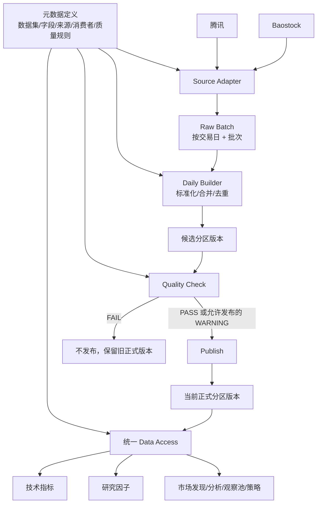

# StockInvestmentTool 可信数据链路设计与实施规范 V1.1

> 文档性质：项目内部专项设计、实施计划与验收基准。
>
> 适用仓库：`/opt/stock_data_analyse`
>
> 适用受众：产品负责人、开发者、后续 AI 开发 Agent、测试与验收 Agent。
>
> 保密说明：本文包含真实项目目录和内部模块信息，仅限项目内部使用，勿对外传播。
>
> 状态：基础采集、数据构建、质量、发布、统一访问、指标/因子验证和任务管理后端基础已完成；前端管理信息架构、任务中心完整接管和生产正式切流仍待实施。文档中明确标注为“目标”的内容不得描述成“已经完成”。
>
> 关联文档：[架构总纲](DESIGN.md) · [概要设计](HLD.md) · [执行指南](IMPLEMENTATION_GUIDE.md) · [现状盘点](STATUS.md)

---

## 1. 文档目的

本文是数据链路改造的唯一专项设计真源，解决三个问题：

1. 让产品负责人能够理解每个阶段具体做什么、为什么做；
2. 让没有当前会话上下文的后续 AI 能按阶段开发，不擅自扩大范围；
3. 让验证 Agent 能依据明确的测试矩阵和验收条件判断是否符合预期。

本文不只是页面设计，也不只是数据采集方案。它覆盖从数据进入系统到被业务安全消费的完整生命周期：

```text
元数据定义
  -> 数据采集
  -> Raw 原始批次
  -> 标准化加工
  -> 候选数据版本
  -> 数据质量检查
  -> 正式发布
  -> 统一数据访问
  -> 技术指标与研究因子
  -> 下游业务消费
  -> 数据中心展示和管理
```

核心判断必须始终成立：

```text
任务执行成功 != 数据质量合格
数据生成成功 != 已正式发布
最新生成版本 != 当前正式版本
页面功能可打开 != 数据可以用于交易决策
```

---

## 2. 背景与当前问题

### 2.1 当前已有基础

项目已有以下数据与运维基础：

```text
warehouse/raw/
warehouse/daily/
warehouse/indicators/
warehouse/factors/
warehouse/fundamentals/
warehouse/minute/
warehouse/online/
warehouse/meta.db
output/data/job_runs.db
```

已有能力包括：

- Parquet 月分区；
- SQLite 元数据和任务台账；
- DuckDB 跨分区读取；
- APScheduler 自动任务；
- 日线、技术指标、研究因子任务；
- 任务阶段、进度、部分成功、失败和跳过状态；
- 数据新鲜度和数据中心页面。

本轮不推翻这些基础。

### 2.2 当前实际主链路

当前自动日线链路接近：

```text
腾讯日线接口
  -> 直接写 warehouse/daily/YYYY-MM.parquet
  -> 全量更新技术指标
  -> 全量更新研究因子
```

这条链路存在以下问题：

1. Raw 层虽然存在，但生产主链路没有稳定使用；
2. 无法可靠回答某次正式数据由哪些来源批次生成；
3. 程序没有抛异常时，任务可能成功，但数据可能不完整；
4. 新数据直接进入正式目录，缺少候选、检查、发布边界；
5. 下游通过目录和文件发现数据，未统一使用“当前正式版本”；
6. 技术指标和研究因子没有完整记录输入日线版本；
7. 不同页面可能使用本地数据、旧缓存或在线回退，但缺少统一上下文；
8. 数据中心能看到日期和记录数，但不能完整解释来源、质量、版本和下游影响。

### 2.3 本轮要解决的核心问题

本轮目标不是增加更多数据字段，而是建立第一条可信数据链路：

```text
stock_daily 从采集到正式消费可追溯、可检查、可发布、可回退。
```

---

## 3. 范围与非范围

### 3.1 本轮范围

第一条完整改造的数据集只有：

```text
stock_daily
```

中文名称：日线数据。

业务定义：股票和 ETF 等纳入证券范围的证券，每个交易日一条价格及成交事实记录。

第一轮开发仅实施：

```text
Phase 0 基线盘点
Phase 1 元数据基础
Phase 2 腾讯 Raw Batch 双写
```

第一轮不得切换现有正式日线消费路径。

### 3.2 后续复用的数据集

`stock_daily` 稳定后，再复用相同机制接入：

```text
industry_daily
valuation_daily
money_flow_daily
fundamentals
indicators
factors
```

不得在 `stock_daily` 第一阶段同时实施这些数据集。

### 3.3 明确不做

本方案内不做：

- 引入 Airflow；
- 引入 Celery；
- 引入 Spark；
- 引入完整 DAG 平台；
- 引入新的大型数据库；
- 把所有 Parquet 改为数据库；
- 把正式日频数据全部改为按日文件；
- 按证券拆分大量文件；
- 一次性改造全部数据集；
- 一次性迁移所有下游页面；
- 自动删除现有 daily、指标、因子或投资账本数据；
- 全量重算所有历史数据；
- 修改股票策略、回测规则和交易规则。

---

## 4. 设计原则

### 4.1 数据生命周期原则

1. Raw 不直接服务正式策略；
2. 正式数据必须能追溯到 Raw Batch；
3. Job Run 只回答程序执行情况；
4. Source Batch 只回答采集到了什么；
5. Dataset Version 只回答生成了什么标准数据；
6. Quality Report 只回答数据是否合格；
7. Publish 只回答是否成为正式可消费数据；
8. 下游默认只使用 Published Dataset；
9. 在线回退不得对正式策略静默发生；
10. 计算窗口与存储分区必须分离。

### 4.2 资源原则

运行环境为 2C2G，优先：

- 单进程或少进程；
- SQLite 和 Parquet；
- 少量、适度大小的文件；
- 有界内存；
- 增量处理；
- 原子替换；
- 不长期复制完整历史版本。

### 4.3 兼容原则

1. 第一阶段保留现有 `warehouse/daily/YYYY-MM.parquet` 路径；
2. 新 Raw 和元数据能力先双写、对账，不立即切流；
3. 现有 API 字段和数据库状态值保持英文，界面显示中文；
4. 旧读取路径在迁移期保留，只能逐模块切换；
5. 每次切换必须有回退开关或旧路径可恢复；
6. 不删除历史文件和运行记录来“修复”兼容问题。

---

## 5. 目标架构



### 5.1 数据事实层级

```text
Source Batch
  某个来源某次采集的原始事实

Dataset Partition Version
  某个数据集某个月份生成的标准候选或正式版本

Quality Report
  对某个候选版本的质量判断

Dataset Current
  某个数据集某个月份当前正式使用的版本指针
```

### 5.2 数据依赖与执行顺序

数据依赖：

```text
indicators <- stock_daily
factors    <- stock_daily
```

当前执行顺序可以是：

```text
更新日线数据
  -> 更新技术指标
  -> 更新研究因子
```

执行顺序不代表研究因子读取技术指标。

---

## 6. 数据集定义与元数据模型

元数据管理不是只服务采集阶段，而是贯穿定义、采集、加工、质量、发布和消费。

### 6.1 元数据分类

| 类型 | 回答的问题 |
|---|---|
| 数据集元数据 | 数据集是什么、一行代表什么、主键是什么 |
| 字段元数据 | 字段含义、类型、单位、是否可空 |
| 来源元数据 | 哪个平台采集什么字段、如何映射和转换 |
| 血缘元数据 | 由什么输入生成、被哪些模块消费 |
| 质量元数据 | 什么条件算合格、阈值是什么 |
| 运维元数据 | 当前版本、最近任务、质量和发布状态 |

### 6.2 `stock_daily` 数据集定义

```text
内部名称：stock_daily
中文名称：日线数据
粒度：一个证券的一个交易日
主键：date + code
分区：按月
更新频率：交易日收盘后
正式存储：warehouse/daily/YYYY-MM.parquet
```

### 6.3 标准字段 V1

| 字段 | 中文名称 | 类型 | 单位 | 可空 | 说明 |
|---|---|---|---|---|---|
| `date` | 交易日期 | date | - | 否 | 业务交易日 |
| `code` | 证券代码 | string | - | 否 | 标准证券代码 |
| `open` | 开盘价 | float | 元 | 条件可空 | 停牌或来源缺失时单独报告 |
| `high` | 最高价 | float | 元 | 条件可空 | 同上 |
| `low` | 最低价 | float | 元 | 条件可空 | 同上 |
| `close` | 收盘价 | float | 元 | 否 | 正常交易记录必须大于 0 |
| `pre_close` | 前收盘价 | float | 元 | 可空 | 用于涨跌计算和校验 |
| `volume` | 成交量 | float | 股 | 否 | 停牌允许为 0，不允许负数 |
| `amount` | 成交额 | float | 元 | 否 | 停牌允许为 0，不允许负数 |
| `turn` | 换手率 | float | % | 可空 | 来源缺失时允许为空 |
| `tradestatus` | 交易状态 | string/int | - | 可空 | 用于停牌与缺口判断 |

现有 `peTTM`、`pbMRQ` 暂时兼容，但目标上迁移到独立 `valuation_daily`，不继续扩大 `stock_daily`。

### 6.4 Dataset Registry

新增表：

```sql
CREATE TABLE dataset_registry (
    dataset_name TEXT PRIMARY KEY,
    display_name TEXT NOT NULL,
    description TEXT NOT NULL,
    grain TEXT NOT NULL,
    primary_keys TEXT NOT NULL,
    partition_type TEXT NOT NULL,
    storage_path TEXT NOT NULL,
    update_frequency TEXT,
    enabled INTEGER NOT NULL DEFAULT 1,
    schema_version TEXT NOT NULL,
    created_at TEXT NOT NULL,
    updated_at TEXT NOT NULL
);
```

`primary_keys` 使用 JSON 文本保存，例如：

```json
["date", "code"]
```

### 6.5 Dataset Fields

```sql
CREATE TABLE dataset_fields (
    dataset_name TEXT NOT NULL,
    field_name TEXT NOT NULL,
    display_name TEXT NOT NULL,
    data_type TEXT NOT NULL,
    unit TEXT,
    nullable INTEGER NOT NULL DEFAULT 1,
    is_primary_key INTEGER NOT NULL DEFAULT 0,
    description TEXT,
    schema_version TEXT NOT NULL,
    created_at TEXT NOT NULL,
    updated_at TEXT NOT NULL,
    PRIMARY KEY(dataset_name, field_name)
);
```

### 6.6 Dataset Sources

```sql
CREATE TABLE dataset_sources (
    dataset_name TEXT NOT NULL,
    source_name TEXT NOT NULL,
    role TEXT NOT NULL,
    priority INTEGER NOT NULL,
    field_mapping TEXT NOT NULL,
    unit_conversions TEXT NOT NULL,
    request_defaults TEXT,
    enabled INTEGER NOT NULL DEFAULT 1,
    created_at TEXT NOT NULL,
    updated_at TEXT NOT NULL,
    PRIMARY KEY(dataset_name, source_name)
);
```

角色定义：

```text
primary   主来源
validate  校验来源
fallback  缺失回补来源
```

V1 默认：

```text
腾讯：primary
Baostock：validate + fallback
```

### 6.7 Dataset Consumers

```sql
CREATE TABLE dataset_consumers (
    dataset_name TEXT NOT NULL,
    consumer_name TEXT NOT NULL,
    consumer_type TEXT NOT NULL,
    fields_used TEXT,
    purpose TEXT NOT NULL,
    required_quality TEXT NOT NULL,
    fallback_policy TEXT NOT NULL,
    blocked_actions TEXT,
    created_at TEXT NOT NULL,
    updated_at TEXT NOT NULL,
    PRIMARY KEY(dataset_name, consumer_name)
);
```

示例：

| 消费模块 | 用途 | 最低质量 | 回退策略 |
|---|---|---|---|
| 市场发现 | 全市场筛选 | PASS/WARNING | 禁止在线逐证券回退 |
| 技术指标 | 指标计算 | PASS/WARNING | 只读正式版本 |
| 研究因子 | 因子计算 | PASS/WARNING | 只读正式版本 |
| 个股研究 | K 线分析 | PASS/WARNING | 允许显式在线回退 |
| 建仓建议 | 正式决策 | PASS | 禁止静默回退 |

### 6.8 Dataset Partitions

现有 manifest 功能升级为统一分区索引：

```sql
CREATE TABLE dataset_partitions (
    dataset_name TEXT NOT NULL,
    partition_key TEXT NOT NULL,
    file_path TEXT NOT NULL,
    min_date TEXT,
    max_date TEXT,
    row_count INTEGER NOT NULL,
    symbol_count INTEGER NOT NULL,
    file_size INTEGER,
    schema_hash TEXT,
    checksum TEXT,
    current_version_id TEXT,
    status TEXT NOT NULL,
    updated_at TEXT NOT NULL,
    PRIMARY KEY(dataset_name, partition_key)
);
```

第一阶段不得删除现有 `daily_manifest` 和 `factor_manifest`。新表先并存，后续迁移完成后再评估收敛。

---

## 7. 证券范围与覆盖率定义

### 7.1 为什么需要证券范围版本

`expected_symbols` 不能直接使用当前 instruments 总数，因为证券范围会变化，而且可能包含股票、ETF、指数、停牌、新上市或退市证券。

必须明确：

```text
这次任务预期采集哪些证券？
```

### 7.2 Universe Snapshot

V1 增加逻辑证券范围快照，可以先保存为元数据 JSON，不强制新增复杂表。

建议字段：

```text
universe_id
as_of_date
asset_types
active_only
expected_symbols
symbols_checksum
created_at
```

示例：

```text
universe_id: stock_etf_active_20260828
asset_types: [stock, etf]
expected_symbols: 6868
```

### 7.3 两种覆盖率

必须区分：

```text
采集覆盖率 = 成功获取证券数 / 预期请求证券数

交易日数据覆盖率 = 目标交易日有有效记录的证券数 / 当日应有行情的证券数
```

停牌、新上市和退市不能简单归类为采集失败。

---

## 8. Source Adapter 与 Raw Batch

### 8.1 Source Adapter 职责

Adapter 负责：

- 调用外部接口；
- 保存来源原始字段；
- 记录请求上下文；
- 做必要的传输级解析；
- 不执行跨来源业务合并；
- 不直接写正式 daily。

### 8.2 Raw 目录

```text
warehouse/raw/
  tencent/
    stock_daily/
      2026/08/28/
        batch_<batch_id>.parquet
  baostock/
    stock_daily/
      2026/08/28/
        batch_<batch_id>.parquet
```

### 8.3 Raw 原则

1. Raw 文件不可原地修改；
2. 重试不得覆盖旧批次；
3. 一次相同来源、数据集、请求范围和任务上下文的采集过程形成一个 Batch；
4. 不为每个证券创建一个 Source Batch；
5. 单证券成功/失败属于 Batch 明细；
6. Raw 保存来源字段，尽量少做业务转换；
7. Raw 写入必须使用临时文件和原子替换；
8. 每个文件必须有 checksum 和 schema version。

### 8.4 Source Batches 表

```sql
CREATE TABLE source_batches (
    batch_id TEXT PRIMARY KEY,
    dataset_name TEXT NOT NULL,
    source_name TEXT NOT NULL,
    job_run_id INTEGER,
    run_date TEXT NOT NULL,
    trade_date_start TEXT,
    trade_date_end TEXT,
    universe_id TEXT,
    expected_symbols INTEGER NOT NULL,
    success_symbols INTEGER NOT NULL,
    failed_symbols INTEGER NOT NULL,
    skipped_symbols INTEGER NOT NULL DEFAULT 0,
    row_count INTEGER NOT NULL,
    raw_path TEXT,
    schema_version TEXT NOT NULL,
    request_context TEXT,
    checksum TEXT,
    file_size INTEGER,
    status TEXT NOT NULL,
    started_at TEXT NOT NULL,
    finished_at TEXT,
    error_summary TEXT,
    failure_details TEXT
);
```

状态：

```text
running
success
partial_success
failed
```

### 8.5 日期语义

必须区分：

| 字段 | 含义 |
|---|---|
| `run_date` | 任务实际运行日期 |
| `trade_date_start/end` | 本次采集的行情业务日期范围 |
| `expected_trade_date` | 当前规则预期应完整的数据日期 |

不得用任务日期代替行情日期。

### 8.6 Phase 2 双写要求

Phase 2 采用：

```text
腾讯采集
  -> 写 Raw Batch
  -> 记录 source_batches
  -> 继续执行现有 daily 写入
```

Raw 写入或元数据写入失败时：

- 任务应记录告警；
- 是否阻断旧 daily 写入由配置决定；
- 第一阶段默认不阻断旧生产链路；
- 必须在结果中明确 `raw_capture_failed=true`，不得静默忽略。

---

## 9. Daily Builder

### 9.1 目标模块

新增：

```text
warehouse/daily_build.py
```

### 9.2 职责

```text
读取指定 Raw Batch
  -> 校验 Raw schema
  -> 字段映射
  -> 单位转换
  -> 代码和日期标准化
  -> 多来源选择与缺失回补
  -> 主键去重
  -> 与当前正式月分区 Merge/Upsert
  -> 生成候选分区文件
```

### 9.3 主键与覆盖规则

主键：

```text
date + code
```

同主键更新规则：

```text
新候选数据覆盖旧记录
```

但来源冲突不得静默处理。

### 9.4 多来源规则 V1

```text
1. 腾讯有有效记录：使用腾讯
2. 腾讯缺失且 Baostock 有有效记录：允许回补
3. 两边都有且关键字段冲突：记录 source_conflict
4. 冲突是否阻止发布，由质量规则决定
5. 不逐字段随意拼接不同来源
```

### 9.5 Candidate 目录

候选文件与正式文件隔离：

```text
warehouse/candidates/stock_daily/
  2026-08/
    <version_id>.parquet
```

候选文件不得被正式业务 Data Access 返回。

### 9.6 幂等要求

相同输入批次、相同 Builder 版本和相同正式输入分区，重复运行必须得到：

- 相同主键集合；
- 相同字段值；
- 相同 row count；
- 相同 checksum；
- 不重复追加记录。

---

## 10. Dataset Version

### 10.1 版本粒度

版本按：

```text
dataset_name + partition_key
```

生成。

例如：

```text
stock_daily / 2026-08 / stock_daily_202608_<timestamp>
```

### 10.2 逻辑版本而非完整历史复制

Dataset Version 是逻辑版本记录，不代表复制整个仓库。

V1 文件保留策略：

- 当前候选文件；
- 当前正式文件；
- 最近一个可回滚文件；
- 更早版本只保留元数据和 Raw 血缘，不长期保留完整 Parquet。

### 10.3 Dataset Versions 表

```sql
CREATE TABLE dataset_versions (
    version_id TEXT PRIMARY KEY,
    dataset_name TEXT NOT NULL,
    partition_key TEXT NOT NULL,
    candidate_path TEXT,
    published_path TEXT,
    previous_version_id TEXT,
    input_versions TEXT,
    source_batches TEXT NOT NULL,
    row_count INTEGER NOT NULL,
    symbol_count INTEGER NOT NULL,
    min_date TEXT,
    max_date TEXT,
    schema_version TEXT NOT NULL,
    checksum TEXT NOT NULL,
    generated_by_job INTEGER,
    builder_version TEXT NOT NULL,
    quality_status TEXT,
    publish_status TEXT NOT NULL,
    created_at TEXT NOT NULL,
    validated_at TEXT,
    published_at TEXT,
    error_summary TEXT
);
```

### 10.4 Publish 状态

```text
candidate
validated
publishing
published
rejected
publish_failed
superseded
```

### 10.5 Dataset Current

```sql
CREATE TABLE dataset_current (
    dataset_name TEXT NOT NULL,
    partition_key TEXT NOT NULL,
    version_id TEXT NOT NULL,
    published_at TEXT NOT NULL,
    PRIMARY KEY(dataset_name, partition_key)
);
```

下游不得通过文件更新时间猜测正式版本。

---

## 11. Quality Check

### 11.1 目标模块

新增：

```text
warehouse/quality.py
```

V1 只实现 `stock_daily` 必要检查。

### 11.2 质量检查项

#### Freshness

- 候选最大日期；
- 预期交易日期；
- 是否达到预期；
- 任务运行日期与业务日期是否一致。

#### Coverage

- universe_id；
- 预期证券数；
- 实际有记录证券数；
- 采集成功证券数；
- 缺失证券；
- 覆盖率。

#### Duplicate

检查：

```text
date + code
```

重复数必须为 0。

#### OHLC

价格字段有效时检查：

```text
high >= open
high >= close
high >= low
low <= open
low <= close
open > 0
high > 0
low > 0
close > 0
```

必须分别统计：

```text
missing_count
invalid_count
```

#### Volume / Amount

```text
volume >= 0
amount >= 0
```

停牌允许为 0。

#### Internal Gap

检测明显内部交易日缺口，但 V1 默认只产生 WARNING，不直接 FAIL。

判断需考虑：

- 交易日历；
- 上市日期；
- 退市日期；
- 交易状态。

如果这些元数据暂不完整，只报告明显缺口，不做强阻断。

#### Source Conflict

比较腾讯与 Baostock 同主键关键字段差异：

```text
open/high/low/close/volume/amount
```

记录冲突数量、证券和字段。

### 11.3 质量状态

```text
PASS
WARNING
FAIL
```

### 11.4 默认决策矩阵

| 检查项 | 条件 | 默认结论 |
|---|---|---|
| 重复主键 | > 0 | FAIL |
| OHLC 关系错误 | > 0 | FAIL |
| 负成交量或负成交额 | > 0 | FAIL |
| 覆盖率 | >= 99.5% | PASS |
| 覆盖率 | >= 98% 且 < 99.5% | WARNING |
| 覆盖率 | < 98% | FAIL |
| 明显内部缺口 | > 0 | WARNING |
| 少量来源冲突 | 配置阈值内 | WARNING |
| 大量来源冲突 | 超过配置阈值 | FAIL |

阈值必须配置化，不写死在 Builder 或 Web 页面中。

### 11.5 WARNING 发布规则

默认：

```text
PASS    允许发布
WARNING 允许发布，但正式版本标记风险
FAIL    禁止发布
```

是否允许 WARNING 发布必须有配置开关。

### 11.6 Quality Results 表

```sql
CREATE TABLE dataset_quality_results (
    quality_id TEXT PRIMARY KEY,
    dataset_name TEXT NOT NULL,
    partition_key TEXT NOT NULL,
    version_id TEXT NOT NULL,
    status TEXT NOT NULL,
    checks TEXT NOT NULL,
    affected_symbols TEXT,
    publish_allowed INTEGER NOT NULL,
    checked_at TEXT NOT NULL,
    checker_version TEXT NOT NULL
);
```

---

## 12. Publish 设计

### 12.1 目标模块

新增：

```text
warehouse/publish.py
```

### 12.2 Build 与 Publish 分离

```text
Build
  生成候选文件和候选版本

Quality
  判断候选版本是否允许发布

Publish
  切换正式文件和 dataset_current
```

### 12.3 发布流程

```text
1. 确认候选版本存在
2. 确认质量报告存在且允许发布
3. 验证候选 checksum、schema、row count
4. 将版本标记为 publishing
5. 保存当前正式版本为 previous_version_id
6. 原子替换正式 Parquet
7. 在 SQLite 事务中更新 dataset_current
8. 将新版本标记为 published
9. 将旧版本标记为 superseded
10. 延迟清理旧候选或过期回滚文件
```

### 12.4 文件与 SQLite 一致性

文件系统和 SQLite 无法形成天然跨系统事务，必须提供恢复检查。

发布前和应用启动时检查：

- `dataset_current` 指向的版本是否存在；
- 正式文件是否存在；
- 正式文件 checksum 是否匹配版本记录；
- 是否存在 `publishing` 但未完成的版本；
- 是否存在文件已替换但 current 未更新的情况。

不一致时：

- 阻止新的发布；
- 业务继续使用最后一个可确认的正式版本；
- 数据中心显示需要人工处理；
- 不自动删除任何候选或旧文件。

### 12.5 回滚

V1 支持回滚到最近一个正式版本：

```text
current version -> previous published version
```

回滚也是一次 Publish 操作，必须记录新的发布事件，不能只手工改文件。

---

## 13. Unified Data Access

### 13.1 目标模块

新增：

```text
warehouse/datasets.py
```

### 13.2 对外接口

```python
get_current_version(dataset_name, partition=None)

load_dataset(
    dataset_name,
    start_date=None,
    end_date=None,
    symbols=None,
    required_quality="WARNING",
)

get_dataset_context(dataset_name, start_date=None, end_date=None)
```

### 13.3 返回值

建议返回结构对象，而不是只返回 DataFrame：

```python
DatasetResult(
    data=df,
    context={
        "dataset": "stock_daily",
        "partition_versions": {"2026-07": "v101", "2026-08": "v102"},
        "max_date": "2026-08-28",
        "quality_status": "PASS",
        "sources": ["tencent"],
        "generated_at": "2026-08-28T16:20:11",
        "fallback_used": False,
    },
)
```

### 13.4 读取规则

统一入口负责：

1. 根据日期范围计算所需月份；
2. 查询 `dataset_current`；
3. 验证正式版本和文件一致；
4. 读取必要 Parquet；
5. 执行列裁剪、日期过滤、证券过滤；
6. 返回数据上下文；
7. 对质量不满足要求的读取明确失败。

### 13.5 在线回退边界

正式消费：

```text
市场扫描、技术指标、研究因子、正式建仓建议
  -> 只允许 Published Dataset
  -> 禁止静默在线回退
```

研究和查看：

```text
个股研究、行情查看
  -> 可以显式在线回退
  -> 必须返回 fallback_used=true
  -> 页面必须显示“当前使用临时在线数据”
```

---

## 14. 技术指标与研究因子接入

### 14.1 第一阶段目标

先保证输入可信和可追溯，不在同一阶段完成复杂增量算法。

修改：

```text
IndicatorsBuilder
FactorEngine
```

从：

```text
直接枚举 warehouse/daily/*
```

改为：

```text
通过 Unified Data Access 读取 Published stock_daily
```

### 14.2 输入版本记录

每次任务和输出版本必须记录：

```text
input_dataset=stock_daily
input_versions={"2026-07":"v101", "2026-08":"v102"}
```

数据中心必须能判断：

```text
技术指标是否基于当前正式日线版本
研究因子是否基于当前正式日线版本
```

### 14.3 计算范围与存储分区

存储按月不代表只读取当月。

例如生成 2026-08 指标，最大窗口为 250 个交易日：

```text
读取足够覆盖 250 个交易日的历史月份
  -> 计算滚动结果
  -> 只写 2026-08 或受影响月份
```

### 14.4 后续增量改造

后续独立阶段再将：

```text
全历史读取、全历史计算、全历史写入
```

改为：

```text
最大窗口历史 + 新增/修复日期
  -> 计算受影响区间
  -> 只更新受影响分区
```

配置或计算逻辑变化时，扩大重算范围；日常新增一天时，不默认全历史重算。

---

## 15. Job Run 扩展

### 15.1 继续使用现有任务平台

继续使用：

```text
output/data/job_runs.db
```

不新建任务框架。

### 15.2 需要补充的任务上下文

在现有字段基础上记录：

```text
job_type
run_date
trade_date_start
trade_date_end
input_dataset
input_versions
output_dataset
output_version
source_batch_ids
universe_id
expected_symbols
processed_symbols
success_symbols
failed_symbols
error_summary
```

可先通过 `result` JSON 承载非核心字段，避免第一阶段大规模迁移 job_runs schema；稳定后再决定是否提升为独立列。

### 15.3 四种状态分工

| 对象 | 回答的问题 |
|---|---|
| Job Run | 程序是否执行、进度和错误 |
| Source Batch | 采集到了什么、哪些证券失败 |
| Dataset Version | 生成了什么候选/正式数据 |
| Quality/Publish | 是否可靠、是否正式生效 |

页面不得把这四种状态合并成一个“成功/失败”。

---

## 16. 下游消费治理

### 16.1 迁移顺序

```text
1. 技术指标
2. 研究因子
3. 市场发现
4. 个股分析
5. 观察池
6. 持仓
7. 策略
```

每次只迁移一个模块，并进行旧、新读取结果对比。

### 16.2 数据上下文

下游业务至少应获得：

```text
数据集
分区版本
最大日期
质量状态
来源
生成时间
是否在线回退
是否允许正式业务动作
```

### 16.3 业务阻断建议

| 数据情况 | 默认业务行为 |
|---|---|
| Published + PASS | 允许正式消费 |
| Published + WARNING | 允许研究，正式动作按消费者策略决定 |
| Candidate + FAIL | 不发布，不允许下游消费 |
| 无 Published Version | 正式业务阻断 |
| 使用在线回退 | 仅研究展示，正式建仓和策略扫描阻断 |
| 技术指标输入版本落后 | 显示过期，依赖指标的正式动作阻断 |
| 研究因子输入版本落后 | 市场扫描标记过期或阻断 |

---

## 17. 数据中心目标信息架构

数据中心最终应围绕数据生命周期组织，而不是简单堆叠任务表。

### 17.1 数据目录

展示：

- 数据集中文名称；
- 定义和用途；
- 粒度与主键；
- 字段与单位；
- 更新频率；
- 存储分区。

### 17.2 数据来源

展示：

- 腾讯、Baostock 等来源角色；
- 最近 Raw Batch；
- 请求日期范围；
- 预期/成功/失败证券；
- Raw 文件路径；
- 来源冲突。

### 17.3 数据版本

展示：

- 当前正式版本；
- 候选版本；
- 上一个正式版本；
- 分区文件；
- 来源批次；
- 生成任务。

### 17.4 数据质量

展示：

- 新鲜度；
- 覆盖率；
- 重复主键；
- OHLC 异常；
- 成交量和成交额异常；
- 内部缺口；
- 质量结论和发布原因。

### 17.5 任务运行

展示：

- 当前阶段；
- 处理进度；
- 已处理/总证券；
- 当前处理证券；
- 父子任务；
- 错误摘要。

### 17.6 下游影响

展示：

- 哪些模块使用当前版本；
- 技术指标和研究因子的输入版本；
- 哪些业务动作被阻断；
- 哪些页面正在使用临时在线数据。

---

## 18. 分阶段实施计划

每个 Phase 必须独立开发、独立测试、独立验收。前一 Phase 未通过不得自动进入下一 Phase。

### Phase 0：基线盘点

#### 目标

建立迁移前可对比的事实基线。

#### 工作内容

- 只读统计现有 daily 分区；
- 记录 schema、行数、证券数、日期范围；
- 检查主键重复；
- 记录典型业务查询结果；
- 记录日线、指标、因子任务耗时和内存；
- 形成机器可读和 Markdown 基线报告。

#### 建议新增

```text
scripts/audit_stock_daily.py
output/reports/stock_daily_baseline_<timestamp>.json
```

脚本默认只读，不得写生产 Parquet。

#### 验收

- 可重复运行；
- 不修改任何生产数据；
- 能输出所有月分区摘要；
- 能输出主键重复和字段类型；
- 测试使用临时仓库。

### Phase 1：元数据基础

#### 目标

建立数据集、字段、来源、消费者和分区统一定义。

#### 建议新增/修改

```text
warehouse/metadata.py
warehouse/storage.py
tests/test_dataset_metadata.py
```

#### 工作内容

- 创建元数据表；
- 提供幂等初始化；
- 注册 `stock_daily`；
- 注册标准字段；
- 注册腾讯/Baostock 来源映射；
- 注册首批消费者；
- 从现有 daily 文件生成分区索引；
- 不改变现有读取路径。

#### 验收

程序可回答：

```text
stock_daily 是什么？
有哪些字段和单位？
腾讯提供哪些字段？
哪些模块消费它？
当前有哪些分区？
```

### Phase 2：腾讯 Raw Batch 双写

#### 目标

让现有采集留下可追溯的 Raw 证据，但不切换正式 daily。

#### 建议新增/修改

```text
warehouse/source_batches.py
warehouse/raw.py
warehouse/collector.py
web/scheduler.py
ops/job_runs.py
tests/test_source_batches.py
tests/test_raw_atomic.py
```

#### 工作内容

- 生成 batch_id；
- 原子写 Raw 文件；
- 记录请求上下文；
- 记录 universe 和证券统计；
- 保存失败证券摘要；
- 继续执行旧 daily 写入；
- 任务结果包含 Raw Batch 状态。

#### 验收

- 同一天多次采集生成不同 Batch；
- 重试不覆盖旧 Batch；
- Raw 文件损坏不会污染正式 daily；
- 批次统计与采集结果一致；
- 旧生产功能保持不变。

### Phase 3：Daily Builder 双轨

#### 目标

从 Raw 生成候选 daily，并与旧 daily 对账。

#### 建议新增

```text
warehouse/daily_build.py
tests/test_daily_builder.py
tests/test_daily_builder_idempotency.py
```

#### 工作内容

- 标准字段映射；
- 单位转换；
- 主来源和缺失回补规则；
- 冲突记录；
- 月分区 Merge/Upsert；
- 候选文件生成；
- 与旧 daily 自动对比。

#### 验收

- 相同输入幂等；
- 不修改正式 daily；
- 候选与旧链路差异可解释；
- 差异报告包含字段、主键和证券范围。

### Phase 4：Dataset Version

#### 目标

候选数据具有分区版本和完整血缘。

#### 工作内容

- 创建版本表和 current 表；
- Builder 生成 candidate version；
- 记录来源批次、任务、checksum；
- 无数据变化时跳过版本生成；
- 候选版本不允许被正式 Data Access 返回。

#### 验收

- 可查询某分区所有版本；
- 可追溯到 Raw Batch 和 Job Run；
- 相同内容不会误生成重复正式版本。

### Phase 5：Quality

#### 目标

候选版本在发布前必须有结构化质量报告。

#### 工作内容

- 实现 V1 检查项；
- 配置化阈值；
- 输出 PASS/WARNING/FAIL；
- 保存质量报告；
- 保留受影响证券摘要。

#### 验收

- 重复主键阻止发布；
- OHLC 错误阻止发布；
- 覆盖率阈值正确；
- WARNING 发布策略可配置；
- 所有检查使用候选文件，不修改正式数据。

### Phase 6：Publish

#### 目标

质量合格的候选版本安全成为正式版本。

#### 工作内容

- 实现发布状态机；
- 原子替换；
- 更新 current；
- 启动恢复检查；
- 最近版本回滚；
- 发布事件审计。

#### 验收

- FAIL 不改变正式文件；
- Publish 中断仍可读取旧版本；
- current 与文件 checksum 一致；
- 回滚可恢复上一正式版本；
- 不删除 Raw Batch。

### Phase 7：Unified Data Access

#### 目标

所有新消费者通过正式版本读取数据。

#### 工作内容

- 实现版本解析和月份裁剪；
- 返回 DatasetResult；
- 定义质量门槛；
- 定义在线回退；
- 提供旧路径兼容适配器。

#### 验收

- 只读取 current 指向版本；
- 不读取 candidate；
- 质量不满足要求时明确失败；
- 日期和证券过滤正确；
- 上下文包含版本和来源。

### Phase 8：技术指标和研究因子接入

#### 目标

指标和因子使用正式日线并记录输入版本。

#### 工作内容

- IndicatorsBuilder 改用 Data Access；
- FactorEngine 改用 Data Access；
- 记录输入版本；
- 数据中心展示输入版本差异；
- 暂不同时重写增量算法。

#### 验收

- 不再直接 glob daily；
- 输出能追溯到输入日线版本；
- 输入版本落后可被检测；
- 结果与旧实现对账。

### Phase 9：增量计算

#### 目标

减少日常指标和因子全历史重算。

#### 工作内容

- 计算最大 lookback；
- 读取必要历史窗口；
- 确定受影响日期；
- 只更新受影响分区；
- 规则版本变化时扩大范围。

#### 验收

- 日常新增一天不全历史重算；
- 增量结果与全量结果一致；
- 历史回补能重算受影响区间；
- 内存和耗时有基线对比。

### Phase 10：下游迁移和数据中心

#### 目标

业务页面消费正式版本并展示数据上下文。

#### 工作内容

- 按既定顺序迁移；
- 页面展示日期、版本、质量和回退；
- 数据中心展示完整生命周期；
- 增加业务阻断规则。

#### 验收

- 正式策略不静默在线回退；
- 市场发现可看到正式数据版本；
- 个股研究在线回退有明显提示；
- 持仓建议知道价格类型和数据时间；
- 数据中心能解释采集、质量、发布和消费。

---

## 19. API 设计建议

V1 优先内部服务接口，Web API 在对应阶段按需增加。

建议接口：

```text
GET /api/data/catalog
GET /api/data/catalog/<dataset>
GET /api/data/batches?dataset=stock_daily
GET /api/data/versions?dataset=stock_daily&partition=2026-08
GET /api/data/versions/<version_id>
GET /api/data/quality/<version_id>
GET /api/data/current?dataset=stock_daily
```

写操作后续再增加，并必须有明确影响范围：

```text
POST /api/data/build
POST /api/data/publish
POST /api/data/rollback
```

第一阶段不要求实现发布和回滚 API。

API 内部值保持英文，界面负责中文映射。

---

## 20. 配置建议

建议新增独立配置文件：

```text
config/data_quality.yaml
```

示例：

```yaml
stock_daily:
  publish_warning: true
  coverage:
    pass_min: 0.995
    warning_min: 0.98
  duplicates:
    fail_if_gt: 0
  ohlc:
    fail_if_invalid_gt: 0
  source_conflict:
    warning_ratio: 0.001
    fail_ratio: 0.01
```

配置加载失败必须有安全默认值，并记录错误；不得默默使用宽松阈值。

---

## 21. 测试策略

所有测试必须使用 `tmp_path`、临时 SQLite、假数据源和 fake scheduler，不得操作生产 `output/`。

### 21.1 元数据测试

- 初始化幂等；
- 数据集、字段、来源、消费者可查询；
- schema version 更新行为；
- 现有分区索引导入；
- 无生产路径写入。

### 21.2 Raw Batch 测试

- 同日多批次不覆盖；
- 原子写入失败保留旧文件；
- checksum 正确；
- request context 可回放；
- partial_success 统计；
- 失败明细截断和总数一致。

### 21.3 Builder 测试

- 字段映射；
- 单位转换；
- date/code 唯一；
- 腾讯优先；
- Baostock 缺失回补；
- 来源冲突记录；
- 幂等；
- 只影响目标月份。

### 21.4 Version 测试

- 按分区生成；
- source_batches 血缘；
- 无变化跳过；
- candidate 不进入 current；
- previous_version 关系。

### 21.5 Quality 测试

- freshness；
- coverage 三档；
- duplicate FAIL；
- OHLC missing/invalid 分离；
- volume/amount 负值；
- internal gap WARNING；
- source conflict；
- WARNING publish 配置。

### 21.6 Publish 测试

- PASS 发布；
- WARNING 按配置发布；
- FAIL 拒绝；
- 文件替换失败；
- SQLite 更新失败；
- 中断恢复；
- checksum 不一致；
- 回滚；
- 旧版本继续可读。

### 21.7 Data Access 测试

- 只读 current；
- 日期范围裁剪；
- 多分区组合；
- symbols 过滤；
- required_quality；
- candidate 不可读；
- context 完整；
- 正式和研究回退边界。

### 21.8 下游对账测试

- IndicatorsBuilder 新旧结果一致；
- FactorEngine 新旧结果一致；
- Market Discovery 典型筛选一致；
- 个股分析典型 K 线一致；
- 数据版本和上下文可见。

---

## 22. 每阶段通用验收门槛

每个 Phase 完成必须同时满足：

1. 对应设计范围完整实现；
2. 新增聚焦测试；
3. 相关定向测试通过；
4. 全量测试无新增失败；
5. `python -m compileall` 通过；
6. `git diff --check` 通过；
7. 未修改生产 Parquet 或投资账本，除非该阶段明确批准；
8. 旧生产路径保持可用；
9. 有明确的回退方式；
10. 文档状态同步更新。

涉及生产切流、发布、回滚或历史重建的 Phase，必须额外完成：

- 候选和旧链路双读对账；
- 文件与元数据一致性验证；
- 服务健康检查；
- 失败注入验证；
- 回滚演练。

---

## 23. AI 开发执行约束

后续 AI 开始某个 Phase 前必须：

1. 阅读本文档；
2. 阅读 [执行指南](IMPLEMENTATION_GUIDE.md) 的生产与数据安全约束；
3. 检查当前 Git 状态；
4. 不回退其他未提交改动；
5. 对照 Phase 范围，不跨阶段扩需求；
6. 先运行或记录基线测试；
7. 测试使用临时数据目录；
8. 不运行真实采集、重建或发布任务，除非用户明确要求上线验证；
9. 不删除旧数据、旧版本或运行记录；
10. 完成后给出修改文件、测试结果、迁移影响和剩余风险。

后续 AI 不得因为“代码更整洁”而擅自：

- 重写任务平台；
- 替换 SQLite；
- 改变正式目录结构；
- 删除兼容读取；
- 同时迁移多个下游；
- 自动全量重建历史；
- 调整质量阈值；
- 允许 FAIL 数据发布；
- 把在线回退用于正式交易决策。

---

## 24. 验证 Agent 检查清单

验证 Agent 必须按以下顺序审查：

### 24.1 范围

- 是否只实施批准的 Phase；
- 是否修改了禁止范围；
- 是否影响生产数据；
- 是否保留旧路径和回退。

### 24.2 事实模型

- Job、Batch、Version、Quality、Publish 是否分开；
- 是否能追溯 Source Batch -> Version -> Quality -> Current；
- 日期语义是否区分 run_date 和 trade_date；
- 证券范围和覆盖率是否有明确基准。

### 24.3 数据安全

- Raw 是否不可覆盖；
- Candidate 是否不能被正式读取；
- FAIL 是否禁止 Publish；
- Publish 失败是否保留旧正式版本；
- 是否存在文件与 SQLite 不一致恢复机制。

### 24.4 兼容

- 现有 daily 是否仍可读；
- 旧业务是否无行为回归；
- API 是否保持兼容；
- 无关页面和策略是否未被修改。

### 24.5 测试证据

- 是否有 tmp_path 隔离测试；
- 是否覆盖失败和中断；
- 是否覆盖幂等；
- 是否覆盖边界阈值；
- 是否完成全量回归。

最终结论必须为：

```text
通过
带风险通过
不通过
```

阻塞问题必须是明确可复现、可修复的实现缺陷；后续高级能力应单独列为建议。

---

## 25. 完整验收问答

全部阶段完成后，系统必须能立即回答：

### 数据定义

```text
stock_daily 是什么？
一行代表什么？
主键和单位是什么？
```

### 来源

```text
当前正式版本来自哪些腾讯/Baostock Raw Batch？
每个批次采集了什么日期和证券范围？
```

### 采集

```text
预期多少证券？
成功、失败、跳过多少？
失败的是哪些证券？
```

### 加工

```text
采用什么来源优先级？
是否发生来源冲突？
如何完成字段和单位转换？
```

### 版本

```text
每个月份当前正式版本是什么？
候选版本是什么？
上一个正式版本是什么？
```

### 质量

```text
覆盖率是多少？
有没有重复主键？
OHLC 和成交数据是否异常？
为什么是 PASS、WARNING 或 FAIL？
```

### 发布

```text
为什么发布？
为什么拒绝发布？
发布失败后业务使用什么版本？
```

### 存储

```text
正式文件在哪里？
候选文件在哪里？
文件 checksum 是否与版本一致？
```

### 下游

```text
技术指标使用哪个日线版本？
研究因子使用哪个日线版本？
哪些页面消费当前版本？
是否发生在线回退？
```

---

## 26. 风险与应对

| 风险 | 应对 |
|---|---|
| Raw 双写增加磁盘 | 只保留 Raw 批次，正式版本仅保留当前和最近回滚文件；后续制定留存策略 |
| 新旧 daily 结果不同 | Daily Builder 先双轨对账，不立即切流 |
| 文件与 SQLite 不一致 | Publish 恢复检查、checksum、阻止继续发布 |
| 元数据设计过度复杂 | V1 固定服务 `stock_daily`，不做动态数据平台 UI |
| 多来源冲突过多 | 腾讯主源，Baostock 只校验/补缺；冲突进入质量报告 |
| 证券范围误判 | 保存 universe_id 和范围定义，区分采集覆盖率与交易日覆盖率 |
| 质量阈值错误阻断 | 阈值配置化，先报告再调整，不在代码中写死 |
| 线上回退掩盖正式数据问题 | 正式消费禁止静默回退，研究页面显式标记 |
| 迁移影响现有业务 | 分 Phase、双写、双读对账、逐模块切换 |
| 指标/因子仍然很慢 | 先保证版本可信，后续独立实施窗口增量计算 |

---

## 27. 决策记录

以下决策视为 V1.1 已确认，不得在开发中自行更改：

1. 首个完整数据集是 `stock_daily`；
2. Raw 按交易日和 Batch 保存；
3. 正式 daily 继续按月保存；
4. 不按证券拆文件；
5. 腾讯为主来源；
6. Baostock 用于校验和缺失回补；
7. 不自动逐字段混合来源；
8. Dataset Version 按分区管理；
9. 下游只读取 Published Dataset；
10. 正式消费禁止静默在线回退；
11. WARNING 默认允许发布，但必须标记风险并可配置；
12. FAIL 禁止发布；
13. 第一轮只做基线、元数据、Raw Batch 双写；
14. 第一轮不改变现有正式 daily 消费路径；
15. 技术指标和研究因子后续都直接依赖 Published stock_daily；
16. 元数据管理覆盖字段、来源、加工、质量、版本和消费者，不只覆盖采集。

任何需要改变这些决策的实现，必须先更新本文档并获得明确批准。

---

## 28. 文档维护

每个 Phase 完成后，开发者或 AI 必须更新：

- 本文对应 Phase 状态；
- 实际修改文件；
- 数据迁移状态；
- 测试数量和命令；
- 已知风险；
- 当前正式链路是否已经切换。

不得仅通过提交记录判断完成度。实现状态以代码、测试和本文档三者一致为准。

### 28.1 当前实施记录

截至 2026-08-28：

- Phase 0 已完成：新增只读 `stock_daily` 基线审计脚本，支持按月份抽样和 JSON 报告。
- Phase 1 已完成：新增数据集、字段、来源、消费者和分区索引元数据，保留现有 manifest 和 daily 读取路径。
- 元数据定义已迁移到 `config/datasets/stock_daily.yaml`：YAML 管理数据集、字段、来源、消费者和质量配置；SQLite 只保存可查询的运行时投影和实际运行事实；Raw 原始数据继续保存为不可覆盖的文件。
- Phase 2 已完成：腾讯日线采集新增不可覆盖 Raw Batch 双写，记录 Source Batch 和 Job Run 关联，旧 daily 写入继续保留。
- 小量批量验证已完成：使用 3 个证券和临时仓库验证 2 个成功、1 个失败的 `partial_success` 场景，Raw 与旧 daily 均可追溯。
- 全量回归：194 个测试通过。
- 当前正式日线消费路径：未切换，仍为现有 `warehouse/daily/YYYY-MM.parquet`。
- Phase 3-6 已在验证目录完成基础闭环：Raw Batch -> Candidate Builder -> Dataset Version -> Quality -> Publish；生产下游仍未切换。
- 辅助源采集已具备统一 Raw Batch 入口：`industry`、`fundamentals`、`valuation_daily`、`money_flow_daily` 均有 YAML 定义和持久化模拟样例；现有生产正式落盘路径保持兼容。
- 辅助源定时采集使用显式开关：`WAREHOUSE_AUX_SYNC=1` 启用行业和财务史，`WAREHOUSE_MONEY_FLOW_SYNC=1` 额外启用资金流；估值继续由日线后的定向回补流程触发。
- 持久化验证目录 `output/validation/data_pipeline/` 已包含 `stock_daily` Raw、Candidate、版本/质量/current 台账及四类辅助源 Raw；该目录仅用于后续流程验证，不作为生产数据。
- Phase 7 已完成验证：`warehouse/datasets.py` 只读取 `dataset_current` 指向的 Published 文件，校验 checksum 并返回版本、质量、来源上下文；没有 current 时必须显式开启 legacy 兼容模式。
- Phase 8 已完成小量接入验证：指标和因子 Builder 通过 Unified Data Access 读取 Published `stock_daily`，返回 `input_versions`，验证数据输出成功且未使用旧路径回退。
- 数据、指标、因子阶段已完成验证收口：指标和因子输出均登记为 Published 派生数据集，具有输出版本、质量状态和 `stock_daily` 输入版本血缘；默认生产入口禁止 legacy daily 回退。
- Phase 9 已完成基础有界窗口规划：增量计算按最大 lookback 计算受影响月份，支持只重写受影响输出分区；完整历史增量性能基线仍待生产规模数据验证。
- 数据构建层已完成验证收口：`stock_daily` 支持按 Source Batch 自动选取、YAML 来源优先级和单位转换、Candidate 幂等、新旧差异报告、完整基础质量检查、Publish 状态和回滚；辅助数据集具备通用 YAML Builder/Publish 骨架，尚未切换生产正式消费。
- 已新增 `scripts/convert_legacy_daily.py`，旧 daily 只能只读转换到隔离迁移目录并标记为 `legacy_daily`，不得伪装成原始 Raw 或直接进入正式 current。
- 任务/指标管理后端基础层已完成：任务定义与配置版本、统一执行请求、结构化事件和文本日志、任务产物、文件预览、基础血缘、指标定义/版本/健康和任务指标关联均已具备；前端页面尚未按新信息架构改版。
- 任务执行框架已补充统一 Runner：定时、手动、补数、重试和 Shadow 使用统一执行请求契约，执行请求绑定任务配置版本、周期区间、触发方式和证券范围；阶段事件、文本日志、产物登记和血缘可统一查询。
- 架构沉淀：任务中心负责任务定义、周期、执行请求、运行过程和技术产物；数据中心负责数据/指标定义、统一口径、最新周期、覆盖和健康。任务阶段、任务类型、数据产物和指标健康不得混用，统一术语见 `TASK_DATA_GLOSSARY.md`。
- 证券类型适配已完成基础实现：`stock/etf/index` 使用独立 YAML profile 定义数据集和指标的 `required/optional/not_applicable`，任务通过 `scope.asset_types` 声明范围，采集、指标和因子执行会按类型筛选并返回类型统计；混合证券的大批量真实验证尚未执行。
- 新管理库阶段已完成验证：`output/validation/data_pipeline/management.db` 可独立承载 YAML 定义和旧数据版本事实，管理服务支持通过 `MANAGEMENT_DB_PATH` 显式切换；生产页面和调度尚未切换，旧库未删除。
- 混合证券小量 Shadow 验证已完成：3 只股票（`sh600000`、`sh600519`、`sz000001`）和 1 只 ETF（`sh510050`）在 `2026-08-25` 至 `2026-08-28` 完成真实腾讯采集、标准构建、质量、隔离发布、指标和因子计算；类型统计为 `stock=3`、`etf=1`，覆盖率 100%。
- 真实 Shadow Run 已完成两次小批量验证：首轮 `sh600000/sh600001/sz000001` 中 `sh600001` 无有效返回，覆盖率 2/3，质量 FAIL 且正确阻断；第二轮使用 `sh600000/sh600519/sz000001`，覆盖 3/3、5 个交易日共 15 行，质量 PASS，完整生成 Shadow Raw/Candidate/Published/指标/因子并登记产物血缘。
- Shadow 输出位于 `output/data/shadow_validation_retry/`，与正式 `output/data/warehouse/` 隔离；正式 meta.db、daily、indicators、factors 的 checksum 在运行前后保持不变。
