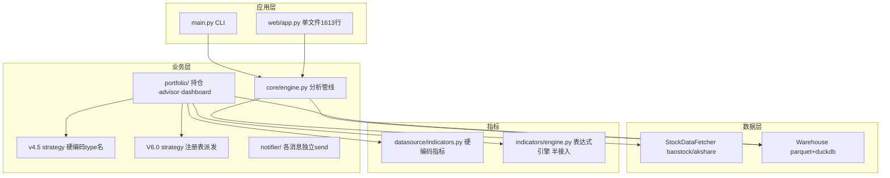
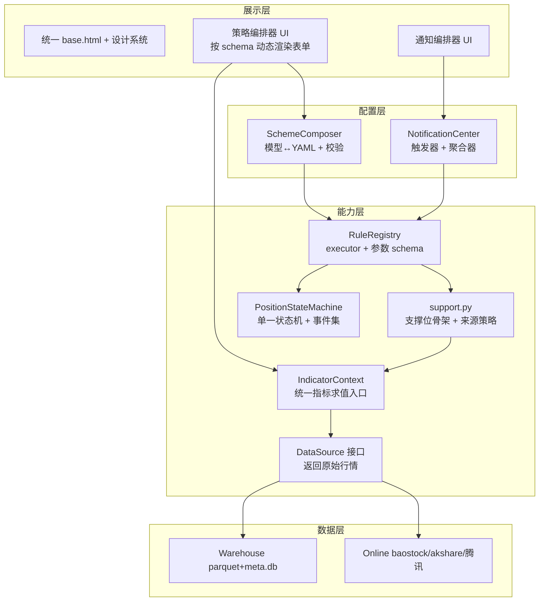
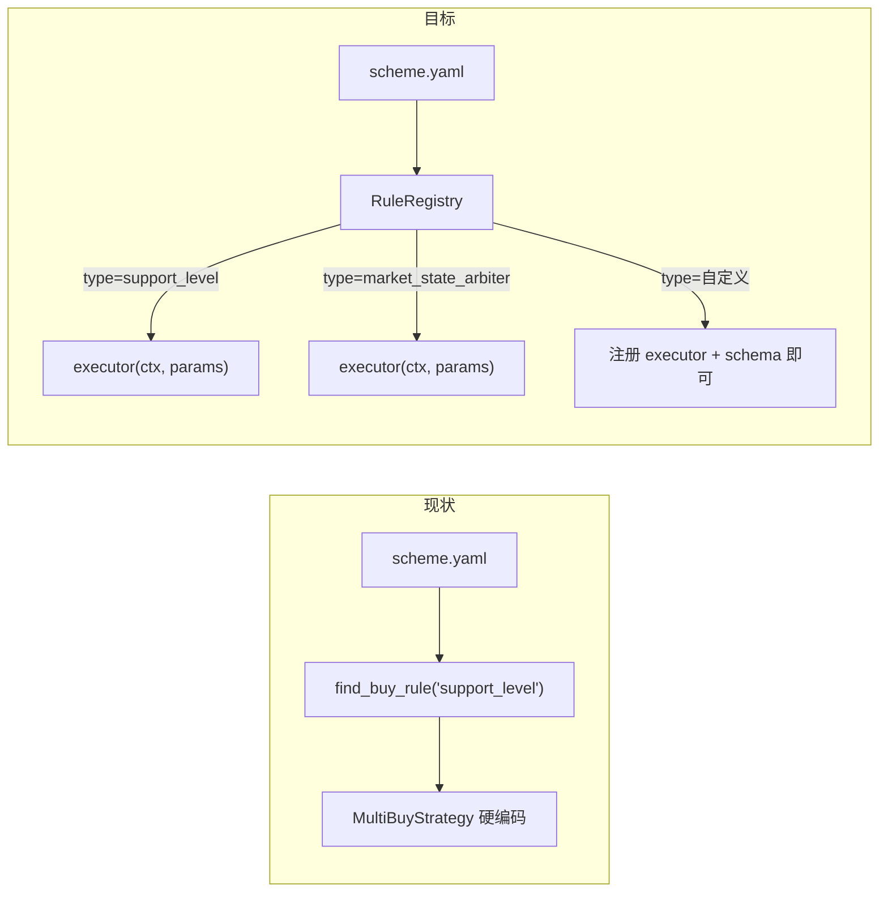
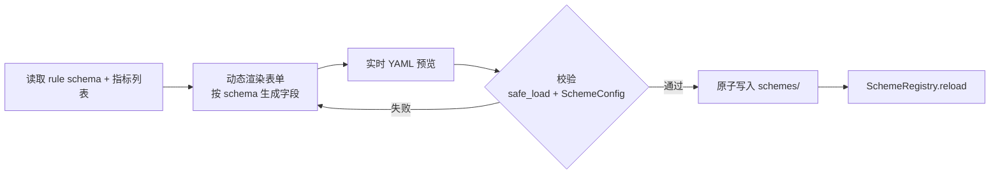
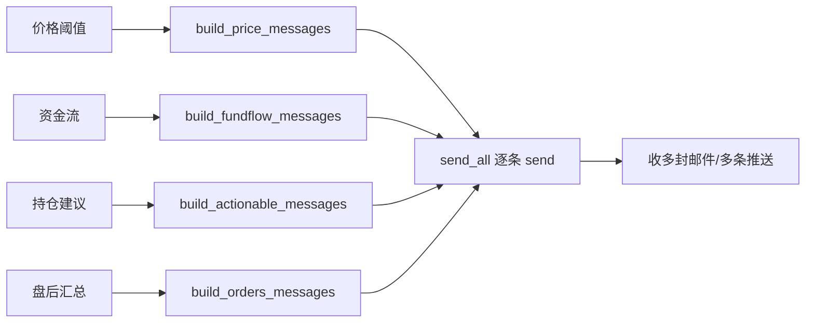
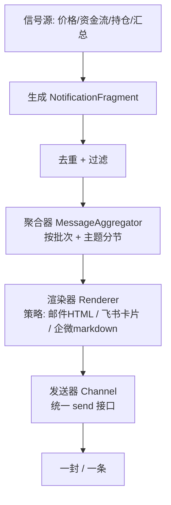

# StockInvestmentTool 概要设计说明书（HLD）

> 版本：v0.3（任务驱动数据生产架构）
> 日期：2026-08-28
> 关联文档：`docs/SRD.md`（需求规格）、`docs/STATUS.md`（现状盘点）、`docs/DESIGN.md`（架构总纲）、`docs/TASK_DATA_GLOSSARY.md`（统一术语）

---

## 1. 引言

### 1.1 设计目标

在满足 SRD 全部 FR/NFR 的前提下，实现方式遵循两条原则：

1. **先抽象骨架，再填充功能**：每个改造点先定义「接口/扩展点」，再让现有功能迁移到骨架上。
2. **让开发者理解「为什么」**：每个模块按 `现状 → 问题 → 目标设计 → 改动点 → 设计意图` 五段组织。

### 1.2 全局设计语言（先建立心智模型）

整个项目只使用**一套设计语言**，所有模块的抽象都遵循它。开发者掌握了这套语言，加任何功能都是「注册 + 填 schema」，而非新开 if-else：

| 手法 | 解决什么 | 在哪些模块使用 |
|------|----------|----------------|
| **模板方法**：提取稳定骨架，可变步骤下沉 | 「算法流程不变，细节可变」 | 支撑位计算、通知处理流水线 |
| **统一上下文对象**（RuleContext / IndicatorContext） | 「参数不固定」——差异用上下文 + params 消化，签名不变 | 规则 executor、指标求值、支撑位 |
| **注册表 + 策略**（type → 策略/executor） | 「类型多样」——新增类型不改旧逻辑 | 规则派发、支撑位来源、渠道、渲染器 |
| **schema 元数据**（参数字段/指标定义） | 「让 UI 和运行时都能动态适配」 | 策略编排器动态表单、通知编排器 |

**判断抽象是否正确的金标准**：新增一个「变体」（新规则、新指标、新渠道、新信号源），是否**无需修改既有代码**就能接入。做不到，说明抽象边界切错了。

### 1.3 任务中心与数据中心的领域边界

系统采用“任务负责执行、数据负责语义”的双中心模型：

```text
任务中心
  Task Definition
    -> Schedule
    -> Execution Request
    -> Task Run
    -> Event/Log
    -> Artifact

数据中心
  Dataset/Metric Definition
    -> Definition Version
    -> Latest Period / Coverage
    -> Health
    -> Consumer
```

任务中心回答“做什么、何时做、处理什么范围、执行到哪里、生成了什么”；数据中心回答“这个数据/指标是什么、口径是什么、最新到哪里、覆盖如何、能否使用”。两者通过 `Task Run -> Artifact -> Dataset/Metric Result` 关联，不把 Raw、Candidate、Quality 等内部技术对象直接作为数据中心主导航。

任务周期是任务属性，必须区分执行频率、数据周期类型、本次执行区间和时区。定时、手动、补数、重试和隔离验证都转换为统一执行请求，由同一个 Runner 执行。

---

## 2. 总体架构

### 2.1 现状架构（问题视角）



**四个核心断裂**（对应 STATUS.md 问题编号）：

| 断裂 | 说明 |
|------|------|
| 两套策略分叉（A1） | v4.5 硬编码 type 名，V6.0 走注册表，互不统一 |
| 支撑位/状态机重复（A2/A6） | 三处 `_get_support_levels`，回测与实盘两套状态机 |
| 指标体系割裂（A5） | 表达式引擎建好但只被 advisor 调用一次，策略 yaml 用写死字段名 |
| 通知无聚合（U3） | 各消息独立 `send_all`，盘后收多封邮件 |

### 2.2 目标架构



**核心主张**：能力层只提供稳定的原子能力与扩展点；配置层把能力编排成产品；展示层只做呈现。三者只依赖接口，不依赖实现。

### 2.3 任务驱动的数据生产生命周期

任务不是调度器中的一个函数名，而是可配置、可追踪、可复用的业务对象：

```text
Task Definition
  -> Schedule（频率、周期类型、起止区间、北京时间）
  -> Execution Request（定时/手动/补数/重试/隔离验证）
  -> Task Run
  -> Event / Log
  -> Artifact
  -> Dataset or Metric Result
```

任务配置使用草稿到生效的生命周期：

```text
draft -> validated -> active -> superseded/disabled
```

任务中心管理执行过程；数据中心管理数据和指标语义。数据中心主视图不以 Raw Batch、Candidate、Quality Report 等技术产物组织，而以基础行情、估值、基本面、技术指标、研究因子和业务指标组织。技术产物只在任务详情或数据详情的技术区域出现。

### 2.4 指标定义与健康

指标定义和指标结果必须分离：

```text
Metric Definition
  = 名称、定义、统一口径、单位、关联任务

Metric Health
  = 最新业务周期、覆盖对象、覆盖率、最近生成状态
```

指标定义不负责固定执行范围；实际范围由任务执行请求决定。没有全市场结果的持仓或模拟指标仍然可以存在，只需在健康状态中表达当前是否有可用上下文或结果。

### 2.5 配置、事实与文件

```text
YAML       声明任务、数据集和指标的静态定义
SQLite     保存配置版本、执行事实、健康、版本指针和血缘
Parquet/CSV 保存原始、标准和派生结果
```

任何新增任务或指标都应优先通过配置、注册表和统一 Runner 接入，不能在页面和调度器中复制一套专用流程。

---

## 3. 能力层设计

### 3.1 统一规则派发 + 统一执行上下文（FR-1.1）

**现状**：
- v4.5 规则执行逻辑硬编码在 `MultiBuyStrategy`/`TakeProfitOptimizer`，靠 `scheme.find_buy_rule("support_level")` 写死 type 名定位。
- 仅 V6.0 有注册表 `strategy/v6_dispatch.py`，且只登记 V6 type。

**问题**：新增规则必须改既有类；且若强行统一 executor 签名，会撞上「不同规则入参差异巨大」的坑（`support_level` 要支撑源、`hard_stop` 要均价/最低价、`market_state_arbiter` 要市场状态）。

**目标设计**——executor 接收统一上下文 + 本规则参数，而非各自位置参数：

```python
# strategy/rule_registry.py（新）
@dataclass
class ParamField:
    key: str
    label: str
    type: str                 # number / select / map / list / text
    default: Any = None
    options: list = None      # select 的可选项
    required: bool = False

@dataclass
class RuleExecutor:
    kind: str                 # "buy" | "sell"
    type: str                 # 规则 type
    fn: Callable              # fn(ctx: RuleContext, params: dict) -> RuleResult
    schema: list[ParamField]  # 参数元数据，供前端动态渲染表单

class RuleRegistry:
    def register(self, executor: RuleExecutor): ...
    def get(self, kind: str, type: str) -> Callable: ...
    def schema(self, kind: str, type: str) -> list[ParamField]: ...
    def types(self, kind: str) -> list[str]: ...
```

**统一上下文**（消化「参数不固定」）：

```python
# strategy/context.py（新）
class RuleContext:
    """规则执行时所有可能用到的输入的超集。"""
    row: pd.Series            # 当前 K 线行
    indicators: IndicatorContext   # 指标求值入口（见 3.3）
    current_price: float
    avg_cost: float
    position_phase: str
    peak_price: float
    year_high: float
    market_state: str
    dividend_anchor: float | None
    # ... 随需求扩展，但不改 executor 签名
```

- `params` 就是 yaml 里该规则的 `params` 原样透传；
- 每个 executor 自带 `schema`，前端据此动态生成表单（见 4.1），**新增规则零前端改动**。

**改动点**：
- 新建 `strategy/rule_registry.py`、`strategy/context.py`；
- `strategy/v6_dispatch.py` 逻辑并入 registry；
- `MultiBuyStrategy`/`TakeProfitOptimizer`/`BacktestEngineV6` 改为 `registry.get(kind, type)` 派发，删除 `find_buy_rule("xxx")` 字面量；
- `core/scheme.py` 不变（YAML 模型不动）。

**设计意图**：注册表 + 策略 + 统一上下文 + schema。扩展点 = `register(RuleExecutor)`。参数差异用 `RuleContext`（超集）+ `params`（透传）消化，签名统一；类型差异用注册表消化；UI 适配用 schema 消化。

**派发流程（前后对比）**：



### 3.2 支撑位 / 状态机去重（FR-1.2）

#### 3.2.1 支撑位：模板方法 + 策略 + 工厂

**现状**：三处实现，但**并非完全相同**——`multi_buy.py` 来源配置驱动，`take_profit.py`/`engine_v6.py` 硬编码三个价格来源；真正相同的是「收集候选 → 排序 → 取强/弱/锚」的**骨架**，不同的是**候选来源**。

**抽象边界**：沿「骨架 vs 来源」切，而不是「合并成一个固定函数」。

```python
# strategy/support.py（新）
class SupportSource(Protocol):
    def compute(self, ctx: IndicatorContext, row: pd.Series) -> float: ...

class MaSource(SupportSource):
    def __init__(self, window: int): self.window = window
    def compute(self, ctx, row): return ctx.ma(self.window)

class RollingLowSource(SupportSource):
    def __init__(self, window: int | None): self.window = window
    def compute(self, ctx, row): return ctx.rolling_low(self.window)

class IndicatorExprSource(SupportSource):
    def __init__(self, expr: str): self.expr = expr
    def compute(self, ctx, row): return ctx.eval(self.expr)

# 骨架：唯一实现，参数 = 来源列表 + 上下文
def get_support_levels(sources: list[SupportSource], ctx: IndicatorContext,
                       row: pd.Series, dividend_anchor: float | None
                       ) -> tuple[float, float, float]:
    cands = sorted(v for s in sources if (v := s.compute(ctx, row)) and v > 0)
    if not cands:
        return 0.0, 0.0, 0.0
    strong = cands[0]
    weak = cands[1] if len(cands) > 1 else strong
    extreme = dividend_anchor or strong
    return weak, strong, extreme

# 工厂：yaml 字段名 → 来源策略
SUPPORT_SOURCE_FACTORY = {
    "ma60":       lambda: MaSource(60),
    "ma20":       lambda: MaSource(20),
    "ma120":      lambda: MaSource(120),
    "ma240":      lambda: MaSource(240),
    "low_3m":      lambda: RollingLowSource(63),
    "year_low":    lambda: RollingLowSource(None),
    # "dividend_anchor" 特殊处理：不进候选，仅作 extreme
}
```

- 三处调用点只负责「用工厂装配来源列表」，不再各自重写排序；
- 未来 `support_sources: ["MIN(MA20,MA240)"]` 直接走 `IndicatorExprSource`，来源退化为「指标求值」。

#### 3.2.2 状态机：状态模式 + 显式事件集

**现状**：`accumulating→holding→left_side→right_side→closed` 在 `manager.py`/`advisor.py`/`take_profit.py`/`engine_v6.py` 四处各自推进。

**目标设计**——转移表统一，事件集显式定义：

```python
# strategy/position_state.py（新）
EVENTS = {"bought", "left_tp", "breakout", "stop", "closed", "reopen"}

class PositionStateMachine:
    TRANSITIONS = {
        ("accumulating", "bought"):   "holding",
        ("accumulating", "left_tp"):  "left_side",
        ("accumulating", "stop"):     "closed",
        ("holding", "left_tp"):       "left_side",
        ("holding", "breakout"):      "right_side",
        ("holding", "stop"):          "closed",
        ("left_side", "breakout"):    "right_side",
        ("left_side", "stop"):        "closed",
        ("right_side", "stop"):       "closed",
        ("closed", "reopen"):         "accumulating",
    }
    def transition(self, current: str, event: str) -> str: ...
```

- **转移表统一**，回测与实盘共用；
- **事件来源不同**：回测的事件来自逐 bar 卖出逻辑，实盘来自 advisor 检查链 + 用户手动交易；副作用（更新 shares/cash/记交易）在各自侧执行，状态机只负责「状态叫什么、往哪转」。

**改动点**：
- 新建 `strategy/support.py`、`strategy/position_state.py`；
- 三处支撑位实现删除，改 import `get_support_levels` + 工厂装配；
- 回测引擎与 advisor 的状态推进改调 `PositionStateMachine.transition`；
- `year_high` 口径统一为单一函数（滚动 252 日窗口，明确新股/短数据期行为）。

**设计意图**：支撑位用「模板方法 + 策略 + 工厂」，状态机用「状态模式」。两者都遵循全局设计语言——骨架/转移表稳定，来源/事件可变，参数差异被策略对象与上下文消化。

### 3.3 指标体系 × 策略打通 + 统一 IndicatorContext（FR-1.3）

**现状**：策略 yaml 用写死字段名，与 `schemes/indicators.yaml` 无关联；`indicators/engine.py` 只在 `advisor.py:127` 被调用一次；且 advisor 有 `AdvisorContext`、支撑位又需指标环境——存在「多个 context 类」的新重复风险。

**目标设计**——定义**唯一的指标求值入口**：

```python
# indicators/context.py（新）
class IndicatorContext:
    """所有指标求值的统一入口，围绕一次行情计算构建。"""
    def __init__(self, df: pd.DataFrame, row_index: int): ...
    def __getitem__(self, name: str) -> float:      # 按指标名取当前值
    def eval(self, expr: str) -> float:             # 任意表达式（含复合）
    def ma(self, window: int) -> float:             # 便捷原子
    def rolling_low(self, window: int | None) -> float: ...
```

- 支撑位的 `MaSource`/`RollingLowSource`/`IndicatorExprSource` 都基于它；
- 规则 executor 的 `RuleContext.indicators` 指向它；
- advisor 的 `compute_context` 改为构建 `IndicatorContext`，替代 `AdvisorContext`。

**YAML 目标形态**：

```yaml
buy_rules:
  - type: support_level
    params:
      support_sources: ["MA60", "MIN(MA20,MA240)"]   # 引用指标体系
      buy_stages:
        - {label: 强支撑, position_index: 0, ratio: 0.4}
        - {label: 弱支撑, position_index: 1, ratio: 0.3}
        - {label: 极端低估, threshold: "0.95*MA20", ratio: 0.3}
```

**来源映射**：`ma60`/`ma20`/`ma120`/`ma240`/`low_3m`/`year_low` 经 `SUPPORT_SOURCE_FACTORY` 映射到来源策略；任意表达式（如 `MIN(MA20,MA240)`）走 `IndicatorExprSource`。

**改动点**：
- 新建 `indicators/context.py`（IndicatorContext）；
- `indicators/engine.py` 暴露「单值/单表达式求值」入口（区别于整表 `compute`）；
- `portfolio/advisor.py` 的 `AdvisorContext` 合并/替换为 `IndicatorContext`；
- 策略执行统一经 `IndicatorContext` 取指标值。

**设计意图**：解释器模式 + 统一上下文。指标是「原材料」，所有人从同一口井打水，消除「多 context 类」的新重复，也让策略编排器（FR-2）能暴露「选指标组策略」的能力。

### 3.4 数据源统一抽象 + DuckDB（FR-1.4）

**现状**：`PriceMonitor.fetch_kline` 的「warehouse 优先、baostock 兜底」if-else 散落多处；`dashboard.py` 的 `stock_chart_series`/`stock_dual_view` 用 pandas 逐月 `read_parquet` + `df[df.code==...]` 过滤。

**目标设计**：

```python
# datasource/base.py（新）
class DataSource(Protocol):
    """统一数据源契约。关键：只返回【原始行情】，不含指标列。"""
    def fetch_kline(self, code, start, end) -> pd.DataFrame: ...
        # 返回列固定: date/open/high/low/close/volume/amount/pe_ttm/pb_mrq/turn
    def fetch_daily_series(self, code, days) -> dict: ...   # 个股图表专用
    def fetch_snapshot(self, code) -> dict: ...

class WarehouseSource(DataSource): ...   # DuckDB 单查询
class OnlineSource(DataSource): ...       # baostock/akshare/腾讯，带兜底
```

**边界澄清**：数据源**只返回原始行情**，指标计算统一在上层（经 `IndicatorContext`）。否则仓库源返回原始列、baostock 源返回带指标列，业务层拿到的列不一致，又会埋「列名不同」的坑。

**改动点**：
- 新建 `datasource/base.py` + 两个实现；
- `dashboard.py` 的 `stock_chart_series`/`stock_dual_view`/`index_kline` 改走 `DataSource` 的 DuckDB 单查询；
- `monitor.py`/`engine.py` 的 if-else 收敛到 `OnlineSource` 的兜底逻辑内。

**设计意图**：抽象工厂/策略模式。扩展点 = `DataSource` 接口。新增数据源只加实现，不碰业务层；同时解决性能（P1）。

---

## 4. 配置层设计

### 4.1 策略编排器（FR-2）

**目标链路**：



**关键点——表单是 schema 驱动的，不写死**：
- 前端先调 `GET /api/rules/schema`（返回所有 rule type 及其 `ParamField` 列表）与 `GET /api/indicators`（返回指标列表）；
- 用户选一个 rule type → 前端按该 type 的 `schema` 渲染表单字段（number 渲染数字框、select 渲染下拉、map 渲染键值表、list 渲染可增删表格）；
- 阈值类字段支持「系数 × 指标」组合输入（引用指标列表）。

**改动点**：
- 新建 `core/composer.py`：结构化模型 ↔ YAML 互转 + 校验（唯一转换点，避免前端拼 YAML 字符串）；
- `RuleRegistry` 提供 `schema(kind, type)`（见 3.1）；
- 新建 `web/templates/strategy_composer.html` + 路由（接口见 §7 I2/I3）；
- `SchemeRegistry` 增加版本/启停读取（配合 §6 数据模型）。

**设计意图**：schema 驱动 + 单一转换点。表单渲染、参数校验、YAML 生成三处都从同一份 schema 派生，新增规则只需在注册时填 schema，前端与后端零改动。

### 4.2 通知编排器（FR-3，含聚合）

**现状（各发各的）**：



现状关键点：`send_all` 逐条 send（`notify.py:375`）；盘后同时存在 `run_post_close_summary` 与 `run_daily_tasks` 内 `notifier --all` 两路各自触发；`EmailSender.send` 与 webhook 的 `send` 签名不一致。

**目标设计**：



**三个扩展点**：

```python
# notifier/core.py（新）
@dataclass
class NotificationFragment:
    topic: str                 # 字符串，非硬编码枚举（price/fundflow/orders/summary/自定义）
    title: str
    lines: list[str]
    priority: int = 0          # 0 即时，1 随批次

class Channel(Protocol):       # 统一发送接口（对齐 EmailSender/webhook 签名差异）
    def send(self, digest: Digest) -> dict: ...

class Renderer(Protocol):      # 按渠道渲染 Digest
    def render(self, digest: Digest, channel: str) -> str: ...

class MessageAggregator:
    def add(self, frag: NotificationFragment): ...
    def digest(self) -> Digest | None: ...   # 按 topic 分节；空返回 None（不发送）

# 渠道 + 渲染器 工厂装配（新增渠道不改调度主流程）
CHANNEL_FACTORY = {"email": ..., "feishu": ..., "wecom": ...}
RENDERER_FACTORY = {"email": HtmlRenderer, "feishu": CardRenderer, "wecom": MarkdownRenderer}
```

- **批次维度**：盘后周期 = 一个批次，聚合后一封发；盘中「操作建议」`priority=0` 即时发，不进盘后批次。
- **信号源可扩展**：每个信号源只负责 `agg.add(fragment)`，不关心「最终怎么发、跟谁合并」；新增信号源 = 新增一个投递片段的生产者。
- **渠道可扩展**：新增渠道 = 实现 `Channel` + `Renderer` + 注册到两个工厂。

**改动点**：
- 新建 `notifier/core.py`（Fragment/Channel/Renderer/Aggregator/工厂）；
- `notifier/notify.py` 的 `build_*_messages` 改为产出 `NotificationFragment`（不直接 send）；
- `notifier/cli.py`、`web/scheduler.py` 的 `run_post_close_summary`/`run_actionable_monitor`/`run_daily_tasks` 统一接入：盘中走即时，盘后走批次；
- `notifier/channels.py` 三类发送器收敛到统一 `Channel` 接口。

**设计意图**：聚合器（Digest）+ 策略（Channel/Renderer）+ 工厂装配。解决「多封信」靠聚合器；「渠道可插拔、签名统一」靠策略；「消息体按渠道定制」靠渲染器。信号源与渠道都通过工厂/注册表装配，新增零侵入。

---

## 5. 展示层设计（FR-4）

**现状**：16 个模板各自内联 `<style>`，`_nav.html` 靠 include 内联 header/nav 样式「保证渲染一致」。

**目标设计**：
- 抽 `web/templates/base.html`（布局骨架）+ `web/static/base.css`（CSS 变量 + 组件类：card/btn/form/table/tag/toast）；
- 所有页面继承 base，删除各自内联重复样式；
- 导航收敛为单一 `_nav.html` 组件（复用现有做法，样式统一到 base.css）。

**改动点**：
- 新建 `base.html`、`base.css`；
- 16 个模板逐个改为继承 base + 去内联样式；
- 清理冗余路由/模板（`portfolio.html` → `warroom.html` 的陈旧重定向）。

**设计意图**：统一设计系统，非重写前端。保留 Jinja + 原生 JS + ECharts，降低风险。

---

## 6. 数据模型设计

| 变更 | 位置 | 结构 |
|------|------|------|
| 规则注册表 + schema | 内存（代码内） | `type → RuleExecutor(fn, schema)` |
| 支撑位来源工厂 | 内存（代码内） | `字段名 → SupportSource` |
| 统一上下文 | 运行时内存 | `RuleContext` / `IndicatorContext` |
| 方案版本/启停 | 新表 `scheme_versions`（meta.db） | `name, version, yaml, enabled, created_at` |
| 通知触发规则 | 新表/文件 `notify_rules` | `id, name, conditions(json), schedule(json), channel, enabled` |
| 通知聚合批次 | 运行时内存 | `topic → fragments`，不落库 |
| 邮件配置 | .env（沿用） | `EMAIL_TO` 等补全 |

---

## 7. 接口设计（后端 API）

| 编号 | 方法/路径 | 入参 | 出参 | 关联需求 |
|------|-----------|------|------|----------|
| I1 | GET `/api/indicators` | 无 | 指标列表（分组+定义） | FR-2.1 |
| I1b | GET `/api/rules/schema` | kind | 所有 rule type 的参数 schema | FR-2.2 |
| I2 | POST `/api/schemes/compose` | 结构化方案模型 | 生成/校验的 YAML + 校验结果 | FR-2.3 |
| I3 | POST `/api/schemes/save` | name + yaml | 保存结果（版本号） | FR-2.4 |
| I3b | GET `/api/schemes/versions?name=` | name | 版本历史 | FR-2.4 |
| I3c | POST `/api/schemes/toggle` | name + enabled | 启停结果 | FR-2.4 |
| I4 | POST/GET `/api/notify/rules` | 触发器 CRUD | 规则列表/详情 | FR-3.1/3.2 |
| I5 | POST `/api/notify/test` | 渠道+条件样例 | 测试发送结果 | FR-3.3 |
| I6 | POST `/api/chart/stock` | code/period/days | 图表序列（DuckDB 化） | FR-5.1 |

---

## 8. 关键技术决策（ADR）

| # | 决策 | 理由 | 备选（否决原因） |
|---|------|------|------------------|
| ADR-1 | 策略配置用「表单生成 YAML」 | 复用已验证引擎，风险低、渐进 | 前端规则引擎：推翻现有配置体系 |
| ADR-2 | 规则派发用注册表（非配置框架） | 轻量、契合 type+params 模型 | 插件框架（pluggy）：过度设计 |
| ADR-3 | executor 用「统一上下文 + params」而非统一位置参数 | 参数差异用上下文消化，签名稳定 | 统一位置参数：不同规则装不下 |
| ADR-4 | 表单 schema 驱动（注册时填 schema） | 新增规则零前端改动 | 前端写死字段：新增规则改前端 |
| ADR-5 | 支撑位「骨架 + 来源策略 + 工厂」而非单一函数 | 来源可变、参数不固定 | 单一函数：把不同来源硬塞，参数爆炸 |
| ADR-6 | 数据源只返回原始行情，指标统一上层算 | 列一致，避免源差异污染业务层 | 数据源内算指标：列不一致 |
| ADR-7 | 通知聚合用内存聚合器（非队列） | 单进程单用户，批次生命周期短 | 消息队列：重，当前规模不需要 |
| ADR-8 | 前端沿用 Jinja+原生 JS | 改动小、够用 | Vue/React：工作量大，非本期目标 |
| ADR-9 | 指标引用用表达式字符串 | 与 indicators.yaml 一致，灵活 | 结构化 AST：实现成本高，收益不匹配 |

---

## 9. 部署与兼容

- **支撑源命名**：`ma60`/`ma20`/`ma120`/`ma240`/`low_3m`/`year_low` 经 `SUPPORT_SOURCE_FACTORY` 映射；表达式（如 `MIN(MA20,MA240)`）走 `IndicatorExprSource`。
- **老通知配置兼容**：`rules.yaml`/`notify_settings.yaml` 在迁移到新触发器模型前仍可读；新模型保存后优先新结构。
- **回测结果回归**：指标舍入口径统一为 float64 全精度（不 round）后，3 个内置方案回测结果须重录基线并逐字段比对（SRD 验收标准）。
- **部署**：沿用 `stock-deploy`（代码挂载 + `docker compose restart stock-web`），无需 rebuild（本方案不改 `requirements.txt`）。

---

## 10. 风险与依赖

| 风险 | 影响 | 缓解 |
|------|------|------|
| 规则派发迁移破坏回测语义 | 回测结果漂移 | 先建回归基线，逐项迁移并比对 |
| 上下文对象成为「大杂烩」 | 难维护 | RuleContext 只放「规则可能用到的输入」超集，随需扩展，不放行为 |
| 通知聚合影响盘中即时性 | 提醒延迟 | priority 区分即时/批次，即时不走聚合 |
| 老 YAML 兼容层遗漏 | 存量方案报错 | 兼容层枚举全部老字段名 + 单测覆盖 |
| 指标表达式求值性能 | 回测变慢 | 求值缓存 + 仅对变化指标增量计算 |

---

## 11. 实施顺序建议（对应 SRD 优先级）

1. **FR-1.1 规则派发 + 统一上下文** → **FR-1.2 去重（支撑位 + 状态机）** → **FR-1.3 指标打通 + IndicatorContext** → **FR-1.4 数据源**（有依赖顺序，地基）；
2. **FR-5 性能 + FR-4 UI 统一**（见效快，可与 1 并行）；
3. **FR-2 策略编排器 + FR-3 通知编排器**（依赖地基）；
4. 拆 web/app.py 等工程债（Out of Scope，后续独立立项）。
