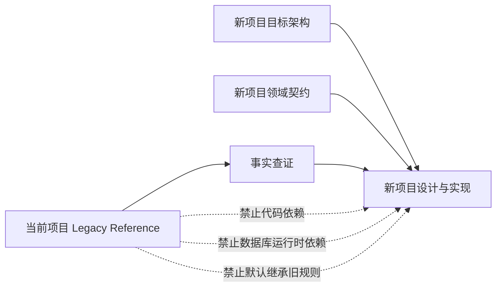
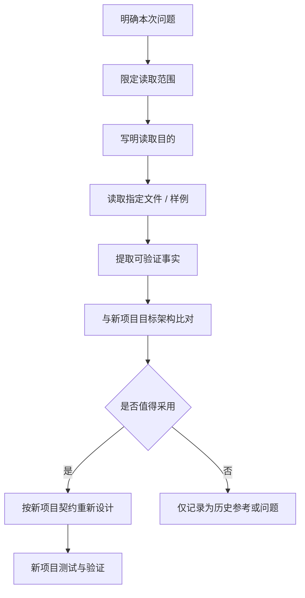
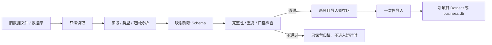

# Legacy 项目参考指南

> 适用对象：未来新项目的设计、开发、数据导入和评审协作。  
> 参考项目：当前 `stock_data_analyse`。  
> 配套目标：`docs/TARGET_ARCHITECTURE.md`。  
> 本文定义参考规则，不改变当前项目代码和运行方式。

## 1. 文档定位

当前项目是新项目的 **Legacy Reference**，不是新项目的代码基座、运行时依赖或架构模板。

新项目应遵循以下优先级：

```text
新项目已确认目标架构
    > 新项目领域模型与公共契约
    > 新项目当前实现和测试
    > 当前项目现状文档
    > 当前项目源代码
    > 历史设计和废弃实现
```

原项目可以回答“过去实际上怎么做、数据是什么、遇到过什么问题”，但不能单独回答“新项目应该怎么设计”。

## 2. 新旧项目边界



### 允许继承的内容

- 已确认的产品目标和业务闭环。
- 经过讨论确认的业务概念和领域边界。
- 外部数据源的可用性、限流、字段和异常经验。
- 历史数据的格式、覆盖范围和质量事实。
- 旧系统的运行问题、性能问题和安全问题。
- 经重新评审后确认仍然有价值的投资逻辑。

### 不允许直接继承的内容

- 当前项目的目录结构和模块命名。
- 当前项目的类、函数和数据库表作为新项目接口。
- `core/engine.py` 的大一统分析编排方式。
- 旧 `strategy/`、`backtest/`、`portfolio/` 的运行时实现。
- 旧 API、页面、调度器和后台任务入口。
- `portfolio.db`、`job_runs.db`、`meta.db` 的运行时依赖。
- v4.5、V6 或其他旧规则的默认行为。
- 未经质量审查的旧数据和未经验证的历史计算结果。

## 3. 何时读取原项目

原项目代码按任务、按文件、按问题读取，不作为每次会话的默认完整上下文。

| 任务 | 建议读取 | 读取目的 |
|---|---|---|
| 设计新数据源适配器 | `datasource/`、相关采集器、数据样例 | 查外部接口、字段、限流和失败模式 |
| 设计数据集 schema | `warehouse/`、Parquet schema、数据文档 | 查历史字段、代码格式、日期和覆盖范围 |
| 设计数据导入 | 旧数据库 schema、导出脚本、样例数据 | 建立映射、识别不可迁移字段 |
| 设计历史策略评估 | 指定的 `strategy/`、`backtest/` 文件 | 理解历史假设，不作为新规则模板 |
| 分析性能和稳定性 | 任务、监控、日志、测试 | 识别资源峰值、限流和失败恢复问题 |
| 复核历史页面行为 | 指定路由、模板、前端脚本 | 了解用户实际操作，不复制页面实现 |
| 评估通知方案 | `notifier/`、通知测试和配置 | 了解渠道约束、重试和去重问题 |

除非任务明确要求，不读取整个原项目目录、所有测试或全部历史文档。

## 4. 读取原项目的标准流程



每次读取原项目后，应明确区分：

```text
历史事实：原项目确实如此实现
设计结论：新项目决定如此设计
实现决定：新项目将如此编码
```

三者不能混写。例如：

```text
历史事实：原项目使用 baostock 获取日线。
设计结论：新项目通过 SourceAdapter 隔离外部数据源。
实现决定：新项目实现 BaostockAdapter，并返回标准 MarketBar Dataset。
```

## 5. Token 使用策略

### 5.1 设计阶段

默认只提供：

- `docs/TARGET_ARCHITECTURE.md`
- 新项目领域模型和公共契约。
- 当前要设计的业务范围。
- 必要的非功能约束。

设计阶段不默认读取原项目大量实现，避免旧目录、旧命名和旧逻辑影响新架构。

### 5.2 实现阶段

只补充完成当前任务所需的 Legacy 资料：

```text
实现 SourceAdapter
    -> 旧数据源相关方法 + 字段样例 + 异常记录

实现历史导入
    -> 旧 schema + 数据样例 + 新 schema

评估历史策略
    -> 指定规则文件 + 回测结果 + 数据依赖
```

不要把无关页面、测试和历史模块一起放入上下文。

### 5.3 评审阶段

评审新项目时优先检查：

- 是否符合目标架构。
- 是否引入当前项目的隐式依赖。
- 是否复制旧表结构或旧业务入口。
- 是否把旧规则当成默认新规则。
- 是否有数据版本、质量和来源记录。

## 6. 各类 Legacy 内容的使用规则

### 6.1 外部数据源

旧项目的数据源实现具有较高事实参考价值，尤其用于确认：

- 请求参数和返回字段。
- 代码、日期和单位转换。
- 连接、重试、限流和降级行为。
- 不同源之间的字段差异。

新项目必须重新封装为：

```text
SourceAdapter
    -> RawBatch
    -> NormalizedRecord
    -> DatasetBuilder
    -> QualityGate
    -> PublishedDataset
```

不能直接复制 `StockDataFetcher` 或让领域服务调用旧类。

### 6.2 历史数据

旧 Parquet、CSV、SQLite 和 JSON 只作为导入输入，不作为新项目正式数据集。



导入时必须保留：

- 原始来源名称。
- 原始记录 ID 或文件路径。
- 导入批次。
- 映射版本。
- 导入时间。
- 质量检查结果。
- 无法映射字段和被拒绝记录的数量。

### 6.3 历史策略

历史策略只能经过重新评审后实现：

```text
历史规则
    -> 投资假设提取
    -> 数据依赖提取
    -> 风险假设审查
    -> 时间穿越 / 未来函数审查
    -> 独立回测验证
    -> 决定：重写、改写或放弃
```

评审结论可能是：

- 作为新策略重新实现。
- 只保留其中的投资思想。
- 作为对照基线，不进入生产策略。
- 因为数据依赖、风险或不可解释性而放弃。

不能将旧类直接包装成新项目的 `RuleExecutor` 就视为迁移完成。

### 6.4 历史页面和 API

历史页面用于确认真实用户操作和信息需求：

- 用户需要查看什么信息。
- 哪些操作需要异步处理。
- 哪些状态需要明确展示。
- 哪些交互存在重复提交或误操作风险。

新项目重新设计 API DTO、页面状态和权限，不复制旧路由和模板结构。

## 7. 新项目开发时的上下文模板

### 7.1 设计任务模板

```text
项目角色：新项目独立重建。

目标架构：以 docs/TARGET_ARCHITECTURE.md 为准。
当前任务：[填写任务]
目标边界：[填写本次只解决什么]
验收标准：[填写可验证结果]

Legacy 使用规则：
- 当前项目仅作事实参考，不是代码模板。
- 只有为解决当前任务所必需时，才读取指定旧文件。
- 旧实现不得直接决定新项目的目录、接口、表结构或规则。
- 如读取旧代码，必须区分历史事实与新项目设计决定。
```

### 7.2 实现任务模板

```text
新项目模块：[模块名]
本次目标：[功能目标]
新项目契约：[接口 / 实体 / 状态]
允许参考的 Legacy 文件：[明确列出文件]
参考目的：[字段 / 外部接口 / 历史行为 / 性能问题]
禁止继承：[旧实现 / 旧表 / 旧规则 / 旧 API]
验证方式：[测试 / 构建 / 冒烟 / 数据校验]
```

### 7.3 历史导入任务模板

```text
导入对象：[portfolio / market data / reports / other]
旧来源：[只读文件或数据库]
新目标：[新 Dataset 或新业务实体]
字段映射：[映射文档]
质量要求：[完整性、去重、时间、口径]
拒绝规则：[无法映射或不可信数据如何处理]
回滚方式：[暂存区清理或导入事务回滚]
```

## 8. 判断是否被 Legacy 误导

出现以下情况时，应暂停实现并重新检查设计边界：

- 新项目目录只是当前项目目录改名。
- 新项目出现 `core/engine.py`，且重新承担所有业务流程。
- 新业务服务直接 import 当前项目模块。
- 新项目数据库表直接照抄旧表名和字段。
- 新策略只是给旧策略类增加一层包装。
- 页面根据旧 API 字段直接设计，而没有新 DTO。
- 业务服务直接读旧 Parquet 路径或旧数据库。
- 旧库被设置成新项目的 fallback。
- 为兼容旧项目而新增大量 if/else、旧状态和旧字段。
- 设计文档频繁出现“先兼容、以后再收口”，但没有明确退出条件。

判断标准：

```text
如果去掉当前项目后，新项目无法独立设计、启动或测试，
说明 Legacy 已经从参考源变成了隐式依赖。
```

## 9. 参考资料索引

当前项目中可按需读取的主要资料：

| 资料 | 用途 | 参考级别 |
|---|---|---|
| `docs/CURRENT_ARCHITECTURE.md` | 当前系统边界、双轨现状和部署事实 | 默认事实索引 |
| `README.md` | 功能、命令、数据源和运行方式概览 | 快速事实参考 |
| `datasource/` | 历史外部数据源和指标实现 | 按任务读取 |
| `warehouse/` | 历史数据采集、分区、版本和发布实现 | 按任务读取 |
| `biz/` | 当前新版业务模型和服务试验实现 | 只参考业务事实，不复制结构 |
| `portfolio/` | 旧持仓、交易、自选和建议实现 | 仅用于历史行为/导入评估 |
| `strategy/`、`backtest/` | 历史策略和回测逻辑 | 仅用于规则评审 |
| `tests/` | 历史行为、边界和已知问题 | 按问题读取 |
| `docs/HLD.md` | 历史目标设计和演进背景 | 不作为新项目最终基线 |

新项目最终设计以 `docs/TARGET_ARCHITECTURE.md` 和新项目自身文档为准。

## 10. 最终原则

```text
原项目用于查事实，不用于定架构。
原项目用于找问题，不用于复制实现。
原项目用于评估历史数据，不用于绑定新数据库。
原项目用于复盘历史规则，不用于默认继承策略。

新项目必须独立设计、独立实现、独立测试、独立运行。
```

一句话总结：

> **让模型知道原项目，但只在需要时让它看到原项目；让目标架构决定新项目，而不是让历史实现决定新项目。**
