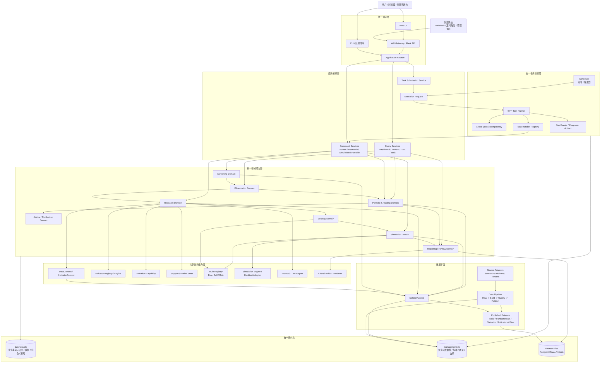
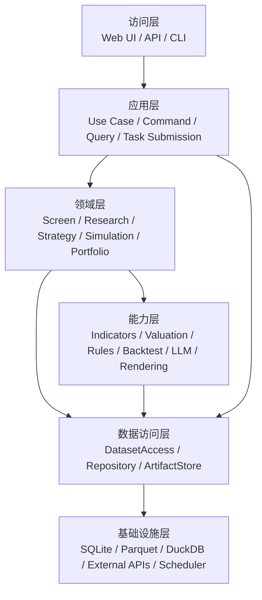
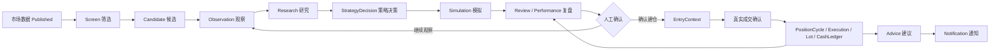
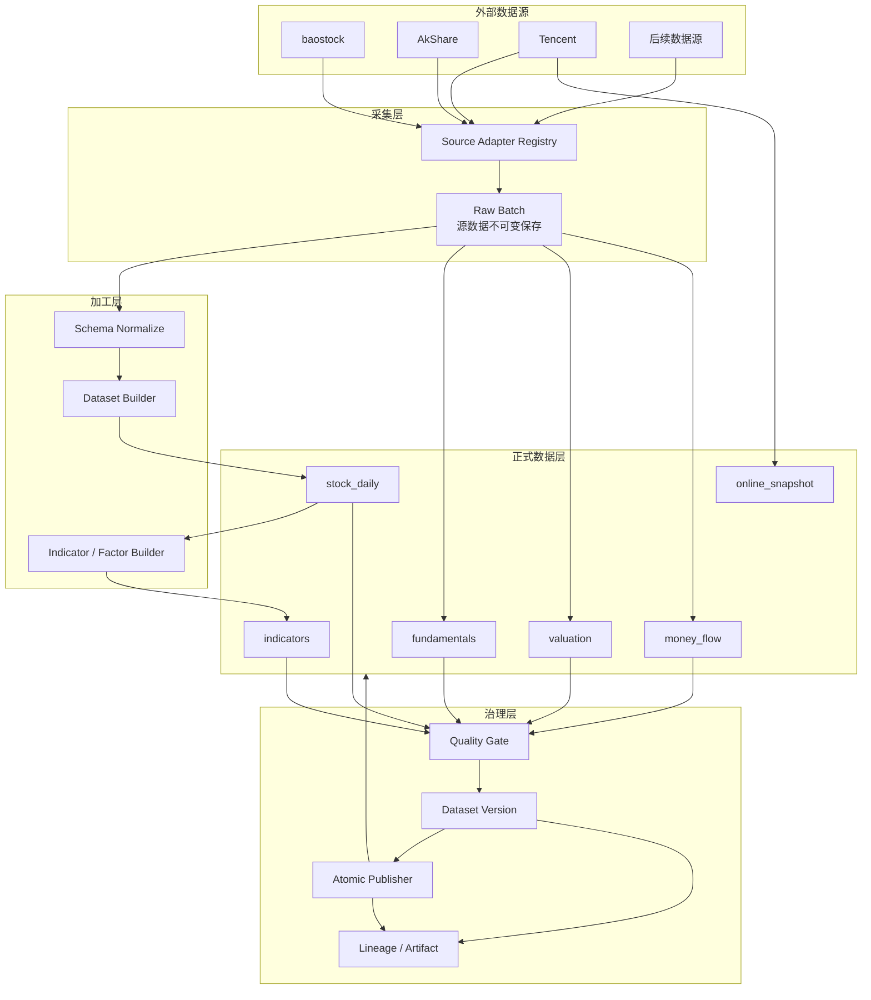
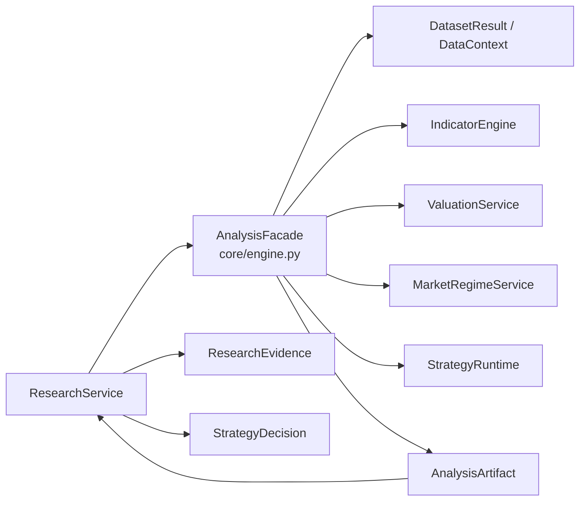
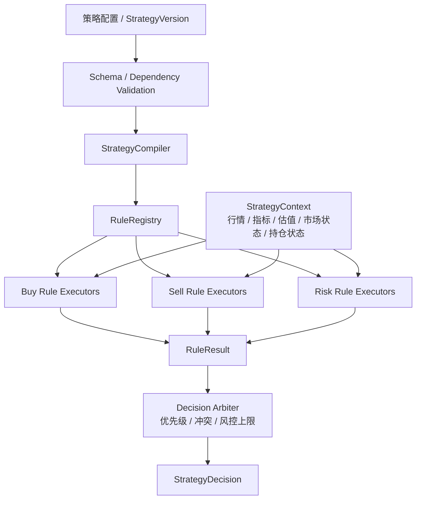
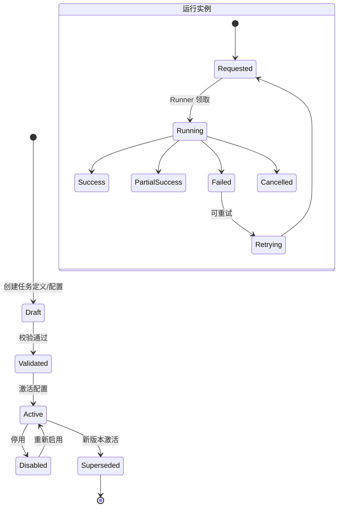
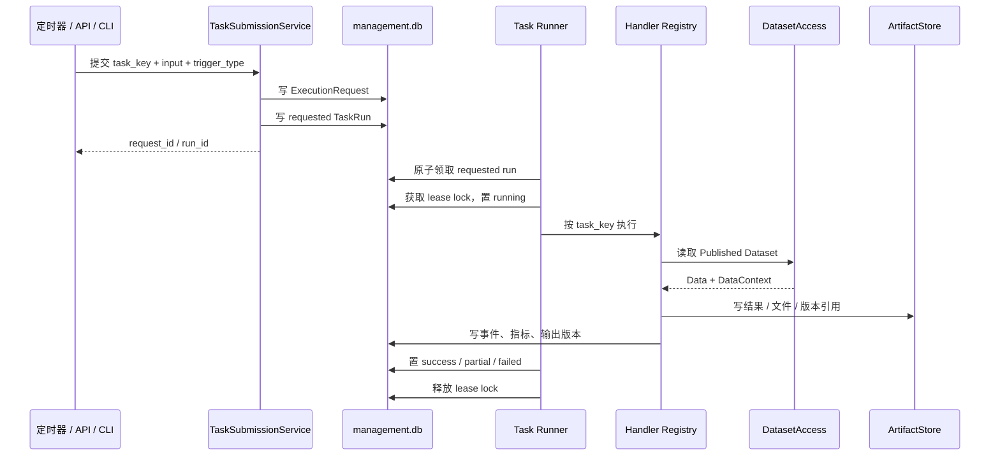
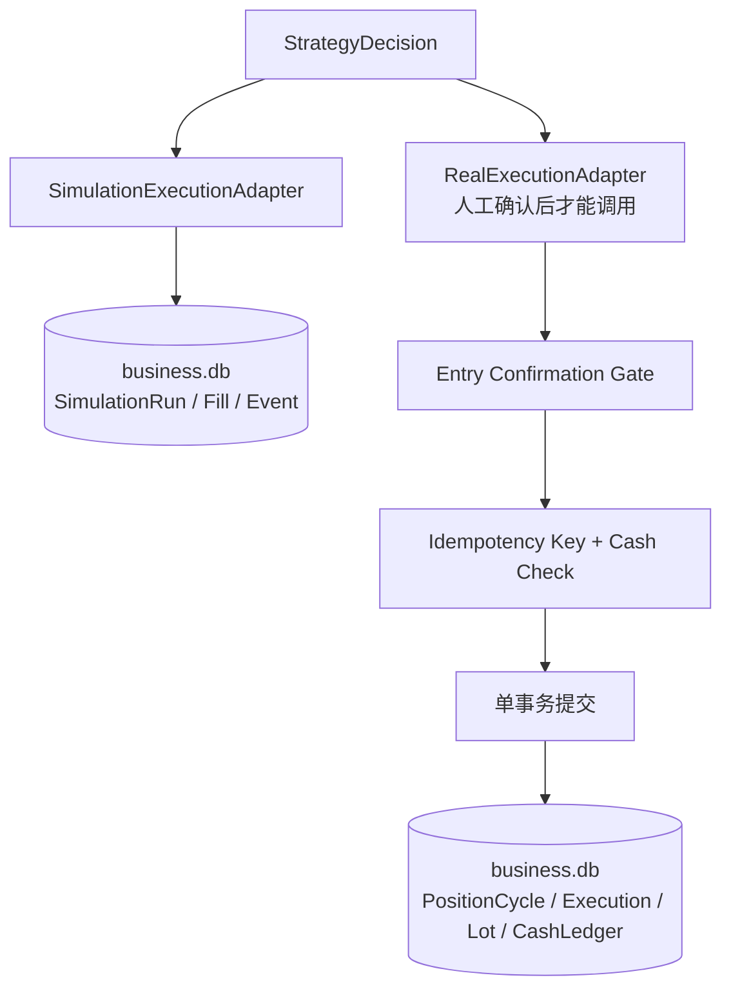
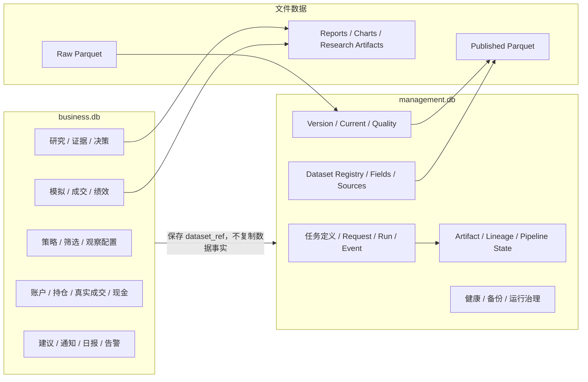

# StockInvestmentTool 目标架构设计

> 版本：v1.0 目标架构  
> 确认基础：当前架构讨论结论  
> 配套现状：`docs/CURRENT_ARCHITECTURE.md`  
> 本文描述预期最终实现，不代表当前代码已经全部完成。

## 1. 设计目标

系统最终应从当前的“双入口、双策略、双业务存储、数据任务与业务任务分裂”收敛为一套统一的投资研究与执行平台：

```text
数据采集与治理
    -> Published Dataset
    -> 选股
    -> 观察
    -> 研究
    -> 策略决策
    -> 模拟验证
    -> 人工确认
    -> 真实建仓与持仓管理
    -> 建议、通知与复盘
```

目标架构必须满足以下原则：

1. **业务统一入口**：正式业务都进入 `biz` 领域服务，不再由 Web 路由或旧 CLI 直接拼装业务流程。
2. **数据统一入口**：业务和研究只消费 Published Dataset，不在业务层直接选择 baostock、AkShare 或腾讯等外部源。
3. **能力与编排分离**：指标、估值、支撑位、规则、回测和图表是可复用能力；Screen、Research、Simulation、Portfolio 是业务编排。
4. **策略统一协议**：v4.5、V6 及后续规则统一注册为策略能力，通过统一上下文、参数 schema 和决策协议执行。
5. **任务统一运行模型**：定时、手工、补数、重试和验证都转换为统一 Request/JobRun，由统一 Runner 执行。
6. **事实单一来源**：业务事实只进 `business.db`，数据管理事实只进 `management.db`，文件数据进入受版本治理的 Dataset 存储。
7. **研究结果可追溯**：每个结果必须能追溯到策略版本、数据集版本、计算版本、输入范围和上游业务对象。
8. **真实交易强隔离**：真实成交不是普通后台任务；必须经过人工确认、幂等键、现金校验和事务提交。

## 2. 最终总体架构



目标架构中的关键变化是：

- `core/engine.py` 不再是独立的旧业务总流程，而变成 Application Facade 下的研究分析门面或可复用分析服务。
- `datasource/` 只保留外部源适配和基础连接能力，不向业务层暴露直接取数入口。
- `strategy/`、`backtest/`、`analysis/` 的可复用算法迁移到统一能力层，并由 `biz.research`、`biz.strategy`、`biz.simulation` 编排。
- 所有正式任务进入统一 Runner，数据任务和业务任务共享任务协议；具体执行资源可以仍然分为数据 Worker 和业务 Worker。
- 业务事实与数据管理事实保持两个数据库，但每个平面只有一个运行时事实源。

## 3. 目标分层模型



依赖约束：

| 层 | 可以依赖 | 不应依赖 |
|---|---|---|
| 访问层 | 应用层 DTO/Facade | 数据库、外部数据源、策略细节 |
| 应用层 | 领域服务、任务提交、查询服务 | Flask 请求对象、Parquet 路径 |
| 领域层 | 领域模型、能力接口、Repository 接口 | baostock、AkShare、页面模板 |
| 能力层 | 标准 DataContext、StrategyContext | 具体 HTTP 路由、业务数据库表 |
| 数据访问层 | Dataset/Repository 抽象、版本元数据 | 页面和具体业务流程 |
| 基础设施层 | 外部库、文件、SQLite、DuckDB | 上层业务决策 |

## 4. 统一业务主流程



每个阶段的核心实体和责任：

| 阶段 | 主实体 | 责任 |
|---|---|---|
| 数据准备 | Dataset / DataContext | 固化数据版本、质量、范围和来源 |
| 选股 | ScreenDefinition / ScreenRun / ScreenCandidate | 按版本化条件筛选并保存候选结果 |
| 观察 | Observation | 保存候选来源、观察周期、状态和目标资金 |
| 研究 | ResearchRun / ResearchEvidence | 生成结构化研究结果和证据 |
| 决策 | StrategyDecision | 使用策略版本生成买卖/风险决策 |
| 模拟 | SimulationPlan / SimulationRun | 按统一规则模拟成交和绩效 |
| 建仓 | PositionCycle / Execution | 人工确认后的真实成交事实 |
| 持仓 | PositionLot / CashLedger | 持仓批次、现金流水、成本和状态 |
| 通知 | Advice / NotificationEvent / Delivery | 建议生命周期、聚合、去重和投递 |
| 复盘 | PerformanceSnapshot / Review | 真实交易与模拟结果对比分析 |

## 5. 统一数据架构

### 5.1 数据生产链路



### 5.2 统一数据消费契约

所有业务数据读取都必须返回统一的 `DatasetResult` 语义：

```text
DatasetResult
├── data                  # 标准 DataFrame 或结构化数据
└── context
    ├── dataset_refs      # 数据集及分区版本
    ├── data_as_of        # 实际数据截止日期
    ├── requested_range   # 请求区间
    ├── quality_status    # PASS / WARNING / FAIL
    ├── source_batches     # 上游源批次
    ├── input_versions    # 上游版本引用
    ├── schema_version    # 数据结构版本
    └── fallback_used     # 是否使用兼容降级
```

业务服务的约束：

- 不直接 import `baostock`、`akshare`、腾讯 URL 或 `read_parquet`。
- 不根据文件目录猜测最新数据，必须通过 `DatasetAccess` 查询 `management.db` 的当前版本。
- 如果指标缺失，必须根据策略依赖决定“阻断、降级或标记不完整”，不能静默使用未声明数据。
- 研究结果、模拟结果和日报都保存 DataContext 引用，而不是只保存一份无法追溯的数值。

## 6. 统一分析能力架构

### 6.1 `core/engine.py` 的目标定位

`core/engine.py` 最终保留，但职责改变：

```text
旧定位：
    一个函数串联数据获取、技术分析、估值、策略、回测、LLM、报告

目标定位：
    研究分析能力 Facade
    输入标准 DatasetResult + StrategyVersion + AnalysisContext
    输出 ResearchArtifacts / AnalysisSnapshot / StrategyDecision 所需的结构化能力结果
```

目标接口关系：



`AnalysisFacade` 不负责：

- 直接调用外部数据源。
- 直接读写业务数据库表。
- 决定 HTTP 返回结构。
- 直接创建 `ScreenRun`、`SimulationRun` 或真实成交记录。
- 把报告文件作为唯一事实结果。

### 6.2 指标与估值能力

目标能力链路：

```text
DatasetAccess
    -> DataContext
    -> IndicatorContext
        -> IndicatorRegistry
        -> IndicatorEvaluator
        -> IndicatorHealth
    -> ValuationContext
        -> PE/PB 分位
        -> 股息锚
        -> 估值区间
        -> 交叉支撑
```

指标必须同时具备：

- 唯一名称和版本
- 输入字段声明
- 计算周期和时间语义
- 单位和缺失值语义
- 依赖数据集
- 质量和覆盖状态
- 计算结果的版本引用

### 6.3 策略统一协议

最终把当前 `strategy/`、V6 派发和 `biz.strategy` 收敛到一个策略运行时：



统一协议的最小模型：

```text
StrategyVersion
    - strategy_id
    - version_id
    - config_hash
    - status
    - dependencies

StrategyContext
    - data_context
    - current_row
    - indicators
    - valuation
    - market_regime
    - position_state
    - portfolio_state

RuleExecutor
    - kind: buy / sell / risk
    - type
    - params
    - schema
    - execute(context, params)

StrategyDecision
    - decision
    - confidence
    - rule_results
    - risk_flags
    - entry_plan / exit_plan
    - strategy_version_id
    - data_context
```

迁移完成后，以下旧逻辑不再作为独立业务入口存在：

- `MultiBuyStrategy` 直接作为 Web/CLI 业务编排入口。
- `TakeProfitOptimizer` 直接决定业务运行状态。
- v4.5 和 V6 各自维护一套不兼容的状态机。
- 业务模块通过字符串字段直接调用某个旧类。

这些代码可以保留为 Rule Executor 或 Simulation Adapter，但必须通过统一策略运行时注册和调用。

## 7. 统一任务运行架构

### 7.1 任务生命周期



### 7.2 统一 Runner



目标执行部署可以保留多个 Worker 类型，但协议必须统一：

```text
Scheduler
    -> management.db / business.db 中的统一 Request/Run

Data Worker
    -> capture / build / quality / publish / indicator

Business Worker
    -> screen / research / simulation / report / notification

Query/API
    -> 只读运行状态、数据状态和业务结果
```

Web 进程不再直接执行长时间数据采集、回测或业务任务；最多只负责提交任务和查询状态。

## 8. 领域模块目标边界

| 模块 | 目标职责 | 明确不负责 |
|---|---|---|
| `biz.screen` | 筛选定义、条件执行、候选结果 | 选择外部数据源、发送通知 |
| `biz.observation` | 候选观察、过期、状态流转 | 重新计算行情指标 |
| `biz.research` | 研究编排、证据、研究结果 | 直接管理真实持仓 |
| `biz.strategy` | 策略版本、编译、决策协议 | 直接获取网络数据 |
| `biz.simulation` | 模拟账户、订单、成交、绩效 | 写真实成交 |
| `biz.portfolio` | 账户、持仓周期、真实执行、现金账 | 运行历史回测 |
| `biz.notification` | 建议、事件、聚合、去重、投递 | 修改研究决策 |
| `biz.reporting` | 日报、复盘、性能快照、Artifact | 直接运行采集任务 |
| `core.engine` | 组合标准分析能力 | 业务状态持久化、HTTP |
| `warehouse` | 数据采集、加工、质量、发布、读取 | 业务决策 |
| `datasource` | 外部数据源适配 | 业务编排 |
| `ops` | 任务、健康、备份、运行治理 | 股票策略判断 |

## 9. 真实交易与模拟隔离

模拟和真实交易使用相同的策略决策协议，但使用不同的执行适配器：



真实建仓前置条件：

- Observation 状态为 `ready_for_entry`。
- 存在明确来源的 Candidate/Research/StrategyDecision。
- 策略版本和数据上下文已固化。
- 用户明确确认，不由定时器自动成交。
- `idempotency_key` 未被使用。
- 现金、数量、价格和交易时间通过校验。
- PositionCycle、Execution、Lot、CashLedger 和 Observation 状态在同一事务中提交。

## 10. 目标存储架构



目标状态：

| 存储 | 是否继续作为运行时事实源 | 说明 |
|---|---:|---|
| `business.db` | 是 | 新业务唯一事实源 |
| `management.db` | 是 | 数据与任务管理唯一事实源 |
| `warehouse/*.parquet` | 是 | 受版本治理的文件数据 |
| `portfolio.db` | 否 | 完成迁移后只读归档，确认后再执行删除 |
| `job_runs.db` | 否 | 历史台账迁移/归档，不再产生新事实 |
| `meta.db` | 否 | 历史 Warehouse 元库迁移/归档，不再运行时回退 |

## 11. API 与页面目标结构

### 11.1 API 分组

```text
/api/v1/
├── datasets/              # 数据集定义、版本、质量、健康
├── tasks/                 # 任务定义、配置、提交、运行、事件
├── screens/               # 筛选定义、版本、预览、运行、候选
├── observations/          # 观察对象、状态、来源、过期
├── research-runs/         # 研究运行、证据、决策
├── strategies/            # 策略定义、版本、校验、发布
├── simulations/           # 模拟计划、运行、成交、绩效
├── portfolios/            # 账户、持仓周期、成交、现金
├── advices/               # 建议生命周期
├── notifications/         # 通知事件、投递、重试、死信
├── reports/               # 日报、复盘、研究报告、Artifact
└── health/                # live / ready / details
```

页面按业务闭环组织，而不是按历史模块组织：

```text
市场与数据中心
    -> 选股中心
    -> 观察池
    -> 研究工作台
    -> 策略与模拟
    -> 作战仓 / 真实持仓
    -> 建议与通知
    -> 复盘与绩效
    -> 任务中心 / 系统设置
```

页面只负责：

- 展示 DTO 和状态。
- 提交命令或任务请求。
- 轮询或订阅任务进度。
- 展示数据版本、质量和结果来源。

页面不负责：

- 直接调用数据源。
- 自己计算策略核心逻辑。
- 直接写数据库。
- 根据返回字段猜测任务是否完成。

## 12. 从当前架构到目标架构的迁移路线

### 阶段一：冻结边界

- 明确 `biz` 是正式业务编排层。
- 明确 `DatasetAccess` 是正式业务数据入口。
- 禁止新功能继续扩大旧 `portfolio.py`、旧 `job_runs.db` 和 `meta.db` 的运行时使用。
- 为新旧结果建立映射和数据上下文引用。

### 阶段二：收拢数据入口

- 将 `core/engine.py` 改为消费 `DatasetResult` 的分析 Facade。
- 将旧持仓监控和看板的行情读取统一转到 `DatasetAccess`。
- 逐步移除业务层直接调用 `StockDataFetcher` 的路径。
- 完成 `management.db` 对数据集、版本、质量和任务事实的统一承载。

### 阶段三：收拢策略能力

- 把 v4.5 买入、止盈、止损和回测逻辑封装为 Rule Executor/Simulation Adapter。
- 把 V6 买入、卖出和市场状态逻辑接入同一 Rule Registry。
- 统一 `StrategyContext`、`RuleResult` 和 `StrategyDecision`。
- 让 `biz.research` 和 `biz.simulation` 只调用统一 Strategy Runtime。

### 阶段四：收拢业务运行

- 数据任务和业务任务统一 Request/Run/Event/Artifact 契约。
- Web 只提交任务，不执行长任务。
- 数据 Worker 负责数据生产，业务 Worker 负责业务运行。
- 统一任务状态、重试、超时、租约、幂等和恢复。

### 阶段五：迁移旧业务事实

- 将 `portfolio.db` 只读评估后迁移到 `business.db`。
- 建立旧 ID 到新实体 ID 的映射。
- 新旧数据对账，切换页面和 CLI 查询入口。
- `portfolio.db` 进入只读归档，不再写入运行时事实。

### 阶段六：下线旧路径

- `job_runs.db` 完成历史迁移和只读归档。
- `meta.db` 完成数据版本、标的和历史元数据对账后进入只读归档。
- 清理生产代码中的隐式默认回退。
- 完成隔离环境冷启动、全量测试、生产只读观察。
- 删除旧文件属于单独的破坏性运维动作，必须备份并人工确认，不与代码迁移绑定。

## 13. 目标架构验收标准

### 13.1 入口与依赖

- [ ] 正式 Web API、CLI 和定时任务均通过 Application Facade 或 Task Submission Service 进入业务。
- [ ] Web 路由不直接调用 `baostock`、`akshare`、`read_parquet` 或业务表 SQL。
- [ ] 新业务代码不再直接依赖旧 `portfolio` 作为事实源。

### 13.2 数据平面

- [ ] 所有业务读取通过 `DatasetAccess` 获取 Published Dataset。
- [ ] 每个业务结果保存 Dataset Version、Data As Of、Quality 和 Schema 引用。
- [ ] 数据任务完成 Raw、Build、Quality、Publish、Current 和 Lineage 闭环。
- [ ] `management.db` 是唯一生产数据管理事实源。

### 13.3 策略与研究

- [ ] v4.5 和 V6 规则都通过统一 Rule Registry 执行。
- [ ] 研究、模拟、真实建议使用同一种 `StrategyDecision` 协议。
- [ ] 回测只是 Simulation Adapter，不再拥有独立业务状态机。
- [ ] 指标、估值和市场状态都具有版本和依赖声明。

### 13.4 任务运行

- [ ] 定时、手工、补数、重试都进入统一 Request/Run 生命周期。
- [ ] 长任务不在 Web 请求线程或 Web 调度线程中执行。
- [ ] 所有任务具备状态、进度、事件、锁、心跳、超时和恢复信息。
- [ ] 任务产物具备 Artifact 和 Lineage 记录。

### 13.5 业务与交易

- [ ] Screen、Observation、Research、Simulation、Portfolio 状态可追溯关联。
- [ ] 真实建仓必须经过人工确认和幂等事务。
- [ ] 真实交易与模拟交易共用决策协议但使用不同执行适配器。
- [ ] 建议、通知和日报都有明确生命周期和投递状态。

### 13.6 存储收口

- [ ] 新业务运行只写 `business.db`。
- [ ] 新数据与任务运行只写 `management.db`。
- [ ] `portfolio.db`、`job_runs.db`、`meta.db` 不再产生新的运行时事实。
- [ ] 旧库备份、迁移、对账和回退方案完成后，才允许人工确认归档或删除。

## 14. 目标架构总结

目标系统不是简单把旧目录移动到 `biz/`，而是完成四个根本收敛：

```text
1. 入口收敛
   CLI / Web / Scheduler -> Application Facade / Task Submission

2. 数据收敛
   外部数据源 -> Data Pipeline -> Published Dataset -> DatasetAccess

3. 策略收敛
   v4.5 / V6 / 新规则 -> Rule Registry -> StrategyDecision

4. 事实收敛
   新业务 -> business.db
   新数据与任务 -> management.db
   旧库 -> 只读迁移 / 归档
```

最终架构可以概括为：

> **一个统一访问入口、一套任务运行协议、一个正式数据消费入口、一套策略决策协议、两个职责清晰的事实库，以及贯穿数据版本、研究证据、模拟结果和真实交易的完整可追溯链路。**
