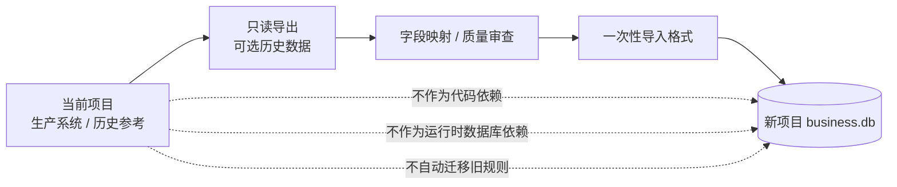
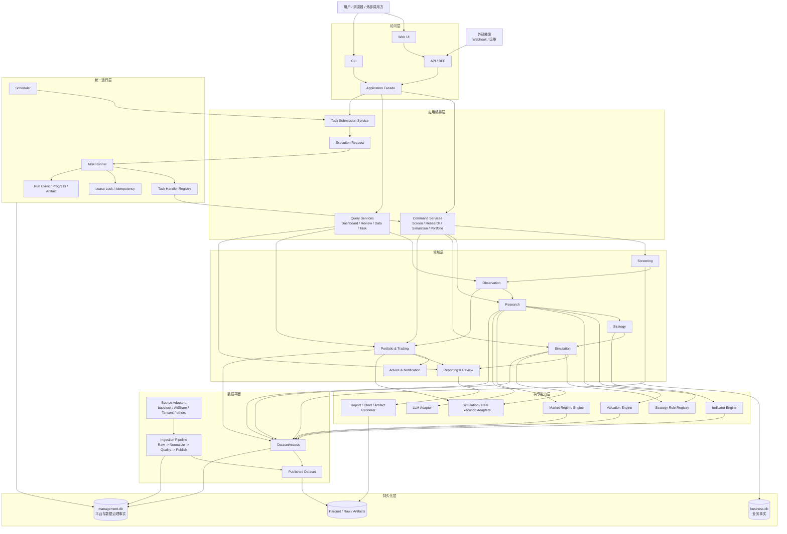
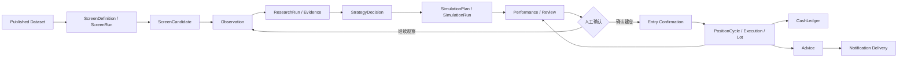
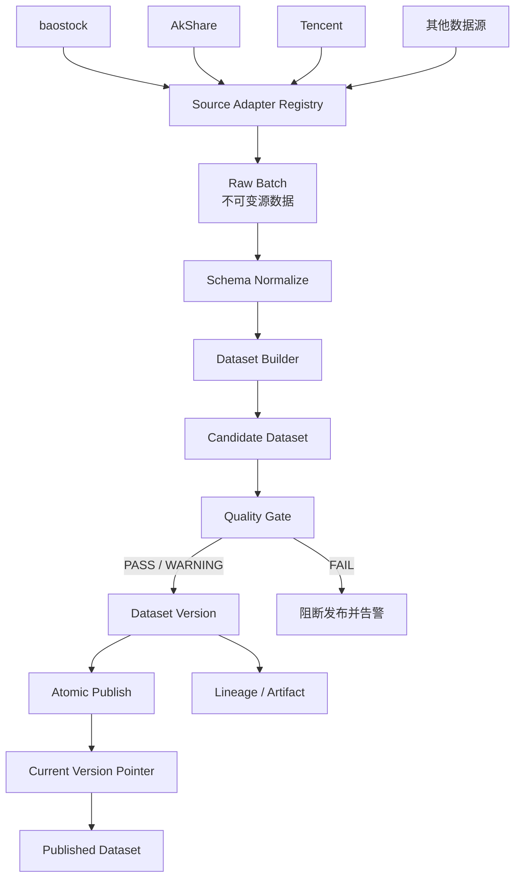
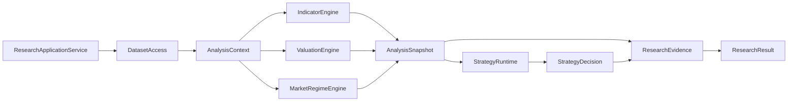
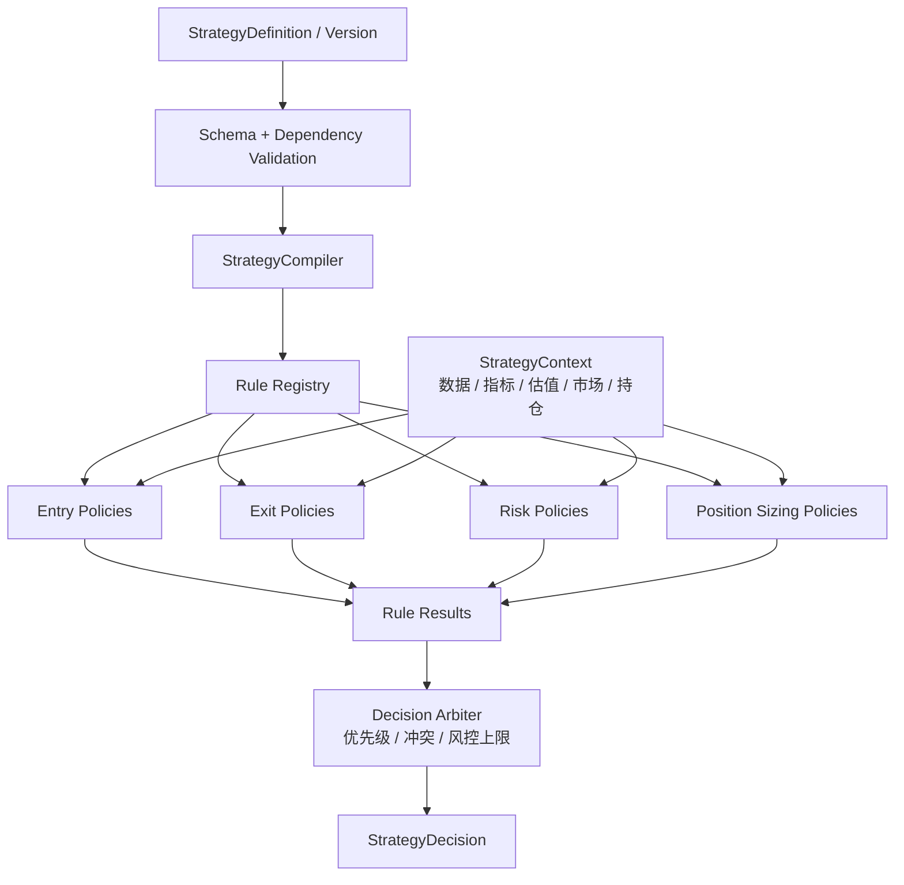
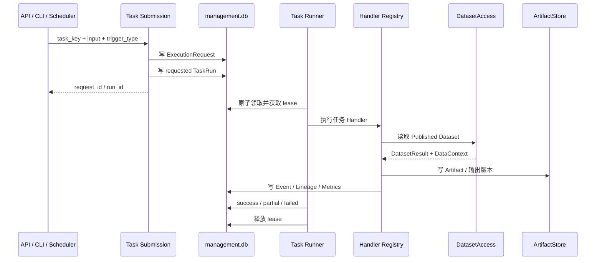
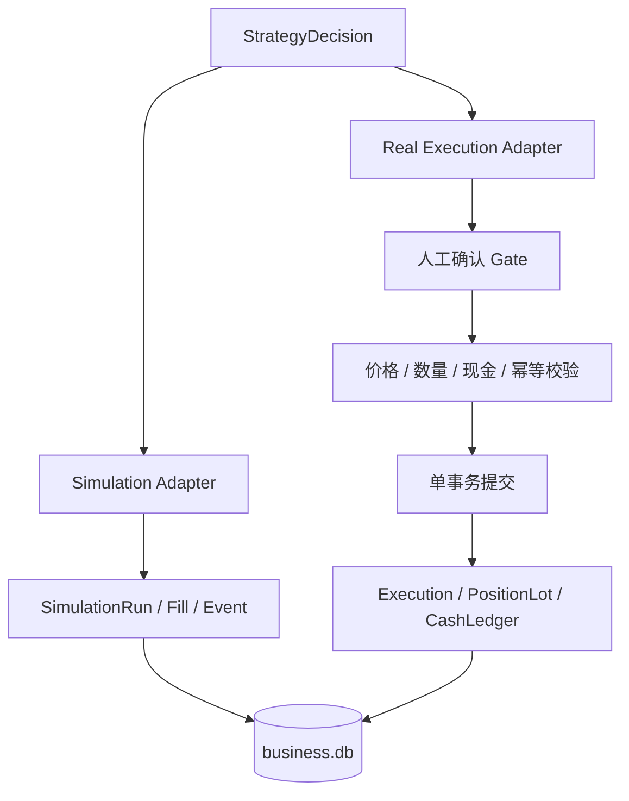
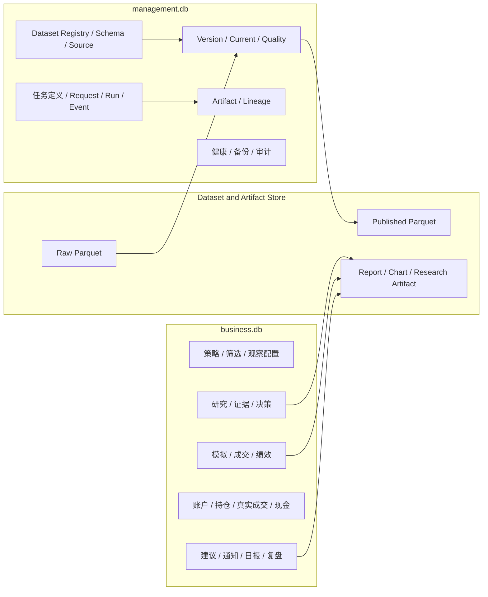
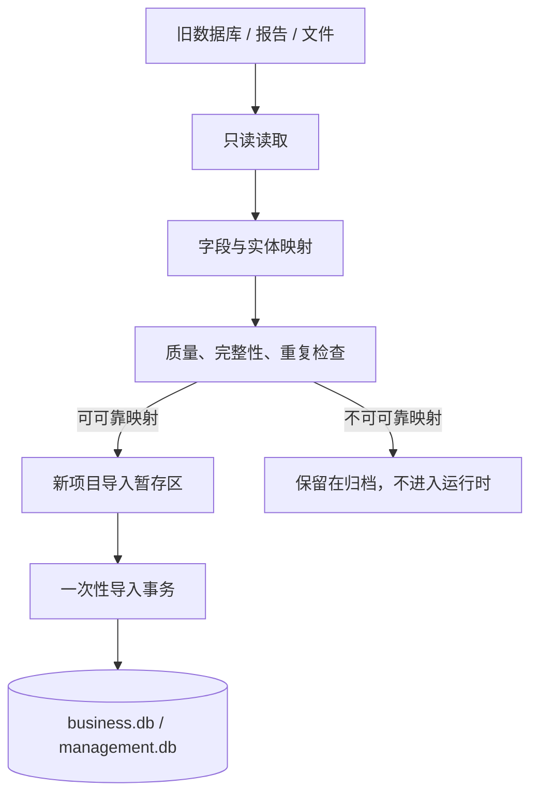

# StockInvestmentPlatform 新项目目标架构设计

> 版本：v2.0 新项目独立重建基线
> 配套现状：`docs/CURRENT_ARCHITECTURE.md`  
> 设计来源：当前架构讨论确认结果
> 本文描述新项目的预期设计，不代表当前项目已经完成，也不要求当前项目继续演进为该架构。

## 1. 架构决策

新系统采用“**全新项目、独立开发、选择性导入历史数据**”的方式建设。

当前 `stock_data_analyse` 项目保留为：

- 当前生产系统和历史参考系统。
- 业务需求、领域概念和运行经验的参考来源。
- 可选历史数据的只读导出来源。

当前项目不作为新项目的代码基座。新项目不继承以下内容：

- 当前项目的目录结构和模块依赖。
- `core/engine.py` 的旧单股分析总编排模式。
- 旧 `strategy/`、`backtest/` 和 `portfolio/` 的运行时实现。
- 旧 `portfolio.db`、`job_runs.db`、`meta.db` 的表结构和运行时依赖。
- 旧 API、旧页面和旧调度器的兼容入口。
- v4.5、V6 等历史规则的默认行为。

新项目只继承经过确认的产品目标和业务思想。历史数据、数据源和历史规则都必须经过重新评审后，才能以新项目契约重新接入。



## 2. 设计目标

新项目建设一套面向 A 股投资研究与执行的完整平台：

```text
数据采集与治理
    -> Published Dataset
    -> 选股
    -> 观察
    -> 研究
    -> 策略决策
    -> 模拟验证
    -> 人工确认
    -> 真实建仓与持仓管理
    -> 建议、通知与复盘
```

核心原则：

1. **新项目独立冷启动**：脱离当前项目代码、旧数据库和旧运行服务后，新项目能够初始化、采集数据并运行最小业务闭环。
2. **业务统一入口**：Web、API、CLI 和定时任务都通过 Application Service 或 Task Submission Service 进入业务。
3. **数据统一入口**：业务只通过 `DatasetAccess` 读取正式数据，不直接调用外部数据源或访问 Parquet 路径。
4. **能力与编排分离**：指标、估值、市场状态、规则、模拟执行和报告渲染是可复用能力；选股、研究、模拟、持仓是业务用例。
5. **策略重新设计**：先定义统一策略协议，再实现新策略；历史规则不是新项目的默认迁移对象。
6. **统一任务运行**：定时、手工、补数、重试和验证都进入统一 Request/Run/Event/Artifact 生命周期。
7. **事实单一来源**：新业务事实只写 `business.db`，平台任务和数据治理事实只写 `management.db`。
8. **结果完整追溯**：研究、模拟、建议和复盘都记录策略版本、数据集版本、计算版本、输入范围和来源实体。
9. **真实交易强隔离**：真实成交必须人工确认，不能由普通定时任务或模拟任务直接触发。

## 3. 总体架构



## 4. 新项目目录结构

目录按业务边界和技术边界重新设计，不复制当前项目的目录名称：

```text
stock-investment-platform/
├── api/
│   ├── routes/                         # HTTP 路由
│   ├── schemas/                        # 请求/响应 DTO
│   └── errors/                         # 统一错误处理
├── application/
│   ├── screening/                      # 选股用例
│   ├── observation/                    # 观察用例
│   ├── research/                       # 研究用例
│   ├── strategy/                       # 策略配置与决策用例
│   ├── simulation/                     # 模拟用例
│   ├── portfolio/                      # 账户与持仓用例
│   ├── notification/                   # 通知用例
│   └── reporting/                      # 报告与复盘用例
├── domain/
│   ├── screening/
│   ├── observation/
│   ├── research/
│   ├── strategy/
│   ├── simulation/
│   ├── portfolio/
│   ├── notification/
│   └── common/                         # ID、时间、状态、上下文
├── capabilities/
│   ├── indicators/                     # 指标定义与求值
│   ├── valuation/                      # 估值能力
│   ├── market_regime/                  # 市场状态
│   ├── strategy_runtime/               # 策略编译、规则注册、仲裁
│   ├── execution/                      # 模拟/真实执行适配器
│   ├── performance/                    # 收益与绩效
│   └── rendering/                      # 报告、图表、研究产物
├── data_platform/
│   ├── source_adapters/                # 外部数据源适配
│   ├── ingestion/                      # Raw Batch 采集
│   ├── normalization/                  # 标准 schema
│   ├── builders/                       # Dataset 构建
│   ├── quality/                        # 质量检查
│   ├── publication/                    # 版本发布与回滚
│   └── access/                         # DatasetAccess
├── runtime/
│   ├── scheduler/                      # 定时触发
│   ├── task_runner/                    # 统一任务执行
│   ├── workers/                        # data/business/system worker
│   ├── locks/                          # 租约锁与幂等
│   └── health/                         # 健康和恢复
├── infrastructure/
│   ├── database/                       # SQLite 连接与迁移
│   ├── files/                          # Dataset/Artifact Store
│   ├── external/                       # HTTP、LLM、通知客户端
│   └── observability/                  # 日志、指标、审计
├── web/                                # 页面和静态资源
├── migrations/                         # 新项目数据库迁移
├── tests/
└── docs/
```

依赖方向固定为：

```text
api/web
    -> application
        -> domain
            -> capabilities / ports
                -> infrastructure / data_platform
```

禁止形成以下依赖：

```text
页面 -> 外部数据源
页面 -> 数据库
领域对象 -> baostock / AkShare
策略规则 -> Parquet 路径
调度器 -> 某个页面函数
新项目 -> 当前项目代码或旧数据库
```

## 5. 领域模型与业务闭环



核心实体：

| 领域 | 实体 | 说明 |
|---|---|---|
| 选股 | `ScreenDefinition`, `ScreenVersion`, `ScreenRun`, `ScreenCandidate` | 定义、版本化和执行筛选 |
| 观察 | `Observation`, `ObservationEvent` | 管理候选来源、期限和状态 |
| 研究 | `ResearchRun`, `ResearchEvidence` | 保存研究过程、证据和结构化结果 |
| 策略 | `StrategyDefinition`, `StrategyVersion`, `StrategyDecision` | 保存策略配置、依赖和决策 |
| 模拟 | `SimulationPlan`, `SimulationRun`, `SimulationFill`, `SimulationEvent` | 独立模拟执行和绩效 |
| 交易 | `Account`, `Portfolio`, `PositionCycle`, `Execution`, `PositionLot`, `CashLedger` | 真实账户和成交事实 |
| 通知 | `Advice`, `NotificationEvent`, `NotificationDelivery` | 建议生命周期和投递状态 |
| 复盘 | `PerformanceSnapshot`, `Review` | 真实与模拟结果对照 |

实体状态和关系必须由新项目重新定义，不复制当前项目的数据库表名或字段名。历史数据只能映射到这些新实体，无法可靠映射时不导入。

## 6. 统一数据架构

### 6.1 数据生产



数据集必须具备：

- 唯一名称、schema 版本和粒度。
- 输入数据集及源批次。
- 分区版本、生成时间和实际数据截止日期。
- 行数、标的数、覆盖范围和质量状态。
- 文件 checksum、发布状态和回滚信息。
- 生产者版本和计算版本。

### 6.2 数据消费

业务模块只能依赖以下抽象：

```text
DatasetAccess.load(
    dataset_name,
    start_date,
    end_date,
    symbols,
    required_quality,
) -> DatasetResult
```

```text
DatasetResult
├── data
└── context
    ├── dataset_refs
    ├── data_as_of
    ├── requested_range
    ├── quality_status
    ├── source_batches
    ├── input_versions
    ├── schema_version
    └── fallback_used
```

新项目业务运行时默认不允许隐式 fallback。若需要使用降级数据，必须由调用方显式指定，并在结果中标记原因。

## 7. 统一分析能力

新项目不保留当前项目的“大一统 `core/engine.py`”。分析能力由多个可组合服务组成：



能力职责：

| 能力 | 职责 |
|---|---|
| `IndicatorEngine` | 根据声明式指标定义计算指标，提供覆盖和健康信息 |
| `ValuationEngine` | 计算估值指标、估值区间和估值解释 |
| `MarketRegimeEngine` | 根据市场数据计算市场状态和置信度 |
| `AnalysisSnapshot` | 固化某个标的、时点和数据上下文下的分析结果 |
| `StrategyRuntime` | 编译策略、执行规则、仲裁冲突并输出决策 |
| `PerformanceCalculator` | 计算模拟、真实交易和基准的绩效 |
| `ArtifactRenderer` | 生成报告、图表和可追踪研究产物 |

分析能力不直接写业务表；应用服务负责将结果转成 `ResearchRun`、`StrategyDecision` 或 `SimulationRun`。

## 8. 全新策略运行时

### 8.1 策略设计原则

新项目先设计协议，再实现策略。历史 v4.5、V6 和其他规则只作为待评审材料，不是首期默认实现。



### 8.2 统一协议

```text
StrategyVersion
    - strategy_id
    - version_id
    - config_hash
    - status
    - dependencies
    - compiler_version

StrategyContext
    - symbol / as_of
    - data_context
    - market_data
    - indicators
    - valuation
    - market_regime
    - position_state
    - portfolio_state

RuleExecutor
    - category: entry / exit / risk / sizing
    - type
    - params
    - schema
    - execute(context, params)

StrategyDecision
    - action
    - confidence
    - entry_plan
    - exit_plan
    - risk_limits
    - rule_results
    - explanations
    - strategy_version_id
    - data_context
```

买入、卖出、风控和仓位计算分开实现，最终由 `DecisionArbiter` 形成一个决策结果。研究、模拟和真实持仓建议都消费同一个 `StrategyDecision` 协议。

## 9. 统一任务运行时

### 9.1 任务模型



### 9.2 任务类型

```text
Data Worker
    - source_capture
    - dataset_build
    - quality_check
    - dataset_publish
    - indicator_build

Business Worker
    - screen_run
    - research_run
    - simulation_run
    - report_generate
    - advice_refresh
    - notification_delivery

System Worker
    - health_reconcile
    - backup
    - cleanup
```

不同 Worker 可以使用不同容器或进程池，但必须共享相同的任务协议、状态模型、幂等语义、事件模型和产物引用规则。

Web 进程只负责提交任务和查询任务，不执行长时间数据采集、研究、回测或通知投递。

### 9.3 状态模型

```text
Task Definition:
    draft -> validated -> active -> disabled / superseded

Task Run:
    requested -> running -> success
                        -> partial_success
                        -> failed
                        -> cancelled

Retry:
    failed -> retry_requested -> requested
```

每个运行必须记录：

- 触发类型、请求人、输入范围和配置版本。
- 开始时间、结束时间、心跳、进度和当前处理对象。
- 锁键、幂等键、尝试次数和错误码。
- 输入数据版本、输出数据版本和 Artifact。
- 上游运行、下游运行和血缘关系。

## 10. 模拟与真实交易隔离



真实交易规则：

- 模拟适配器不能写真实持仓事实。
- 普通定时任务不能直接调用真实执行适配器。
- 建仓必须关联 Observation、ResearchRun 和 StrategyDecision。
- 必须使用幂等键，重复请求不得产生重复成交。
- PositionCycle、Execution、PositionLot、CashLedger 和 Observation 状态在同一事务中提交。
- 真实交易接口必须有独立权限、审计记录和人工确认信息。

## 11. 目标存储架构



新项目启动时只创建新 schema：

| 存储 | 定位 | 新项目要求 |
|---|---|---|
| `business.db` | 业务事实库 | 只保存新领域模型和业务运行结果 |
| `management.db` | 平台事实库 | 只保存任务、数据集、版本、质量、血缘和治理事实 |
| Published 文件 | 正式数据 | 只能通过版本指针和 `DatasetAccess` 消费 |
| Raw 文件 | 源数据 | 不可变保存，不作为业务直接消费入口 |
| Artifact 文件 | 报告、图表、研究产物 | 必须有 Artifact 元数据和来源引用 |

当前项目的 `portfolio.db`、`job_runs.db`、`meta.db` 不进入新项目运行时。需要历史数据时，使用独立导出/导入工具完成一次性导入，并写入 `legacy_import` 来源标记。

## 12. API 与页面

### 12.1 API 分组

```text
/api/v1/
├── datasets/              # 数据集、版本、质量、覆盖
├── tasks/                 # 定义、配置、提交、运行、事件
├── screens/               # 筛选、预览、运行、候选
├── observations/          # 观察对象和状态
├── research-runs/         # 研究、证据、决策
├── strategies/            # 策略定义、版本、校验、发布
├── simulations/           # 模拟计划、运行、成交、绩效
├── portfolios/            # 账户、持仓、成交、现金
├── advices/               # 建议生命周期
├── notifications/         # 通知事件、投递、重试、死信
├── reports/               # 研究报告、日报、复盘和 Artifact
└── health/                # live / ready / details
```

### 12.2 页面信息架构

```text
市场与数据中心
    -> 选股中心
    -> 观察池
    -> 研究工作台
    -> 策略中心
    -> 模拟中心
    -> 作战仓 / 真实持仓
    -> 建议与通知
    -> 复盘与绩效
    -> 任务中心 / 系统设置
```

页面只展示 DTO、数据质量、版本和任务状态，只提交命令或任务请求，不直接取数、计算策略或写数据库。

## 13. 新项目开发阶段

### 阶段一：项目骨架与契约

- 建立新仓库和独立运行环境。
- 确定领域实体、状态机、ID、时间和错误协议。
- 确定 `business.db`、`management.db` 的新 schema。
- 确定 Dataset、DataContext、StrategyContext、TaskRun、Artifact 和 Lineage 契约。
- 完成独立冷启动和健康检查。

### 阶段二：数据平台

- 实现 Source Adapter，不让领域层感知具体数据源。
- 完成 Raw、标准化、质量、版本和 Published 链路。
- 实现 `DatasetAccess` 和数据上下文。
- 用最小数据集完成端到端采集和发布。

### 阶段三：最小业务闭环

只实现：

```text
Screen -> Observation -> Research -> StrategyDecision -> Simulation -> Review
```

首期不接真实交易，不导入全部历史业务数据，不搬运旧策略实现。

### 阶段四：新策略运行时

- 实现策略版本和依赖声明。
- 实现指标、估值和市场状态依赖。
- 实现 Entry、Exit、Risk、Sizing 和 Decision Arbiter。
- 实现第一套新策略 `baseline_v1`，用于验证平台协议。

### 阶段五：账户与真实交易事实

- 实现 Account、Portfolio、PositionCycle、Execution、PositionLot 和 CashLedger。
- 实现人工确认、权限、审计和幂等成交。
- 将 StrategyDecision 接入建议和建仓流程。

### 阶段六：通知、日报与复盘

- 实现 Advice 和 Notification Event。
- 实现 Outbox、重试、死信和渠道适配。
- 实现日报、真实收益、模拟收益、基准和执行偏差复盘。

### 阶段七：选择性历史导入

- 新项目已能独立运行后，再评估历史数据价值。
- 为每类数据建立字段映射、质量报告和导入规则。
- 历史导入只通过一次性工具完成，不成为新项目运行时依赖。

## 14. 迁移与导入边界

“新项目重建”不等于“历史数据全部丢弃”，但历史内容必须服从新模型：



导入要求：

- 旧项目数据库只读，导入过程不修改旧数据。
- 新项目不依赖旧库才能启动和运行。
- 导入记录带 `source=legacy_import`、导入批次和原始 ID。
- 新实体 ID 由新项目生成，旧 ID 只作为外部来源映射保存。
- 无法确定口径、时间或关系的数据不强行导入。
- 导入工具、映射表和报告独立于新项目主运行时。

## 15. 新项目验收标准

### 独立性

- [ ] 删除或隔离当前项目代码后，新项目仍能冷启动。
- [ ] 新项目运行时不 import 当前项目任何模块。
- [ ] 新项目不读取 `portfolio.db`、`job_runs.db`、`meta.db`。
- [ ] 新项目不依赖旧项目 API、旧页面或旧任务进程。

### 数据

- [ ] 所有业务读取通过 `DatasetAccess`。
- [ ] 所有正式数据均经过 Raw、Normalize、Quality、Version、Publish。
- [ ] 业务结果保存 Dataset Version、Data As Of、Quality 和 Schema 引用。
- [ ] 生产数据管理事实只写 `management.db`。

### 策略

- [ ] 策略协议先于具体策略实现完成。
- [ ] Entry、Exit、Risk、Sizing 和 Arbiter 具备独立测试。
- [ ] 第一套策略为新项目策略，不要求兼容旧 v4.5/V6 行为。
- [ ] 研究、模拟和建议共用 `StrategyDecision` 协议。

### 任务

- [ ] API、CLI、Scheduler 统一进入 Task Submission。
- [ ] Web 不执行长任务。
- [ ] Task Run 具备状态、事件、进度、锁、心跳、重试和恢复。
- [ ] 产物具备 Artifact 和 Lineage。

### 业务与交易

- [ ] Screen、Observation、Research、Simulation、Portfolio 可追溯关联。
- [ ] 模拟和真实执行适配器严格隔离。
- [ ] 真实建仓具备人工确认、权限、审计和幂等事务。
- [ ] 建议、通知和复盘具备完整生命周期。

## 16. 最终结论

新项目不是当前项目的重命名，也不是把旧目录迁移到新目录，而是一次有边界的重新设计：

```text
不继承旧代码
不继承旧运行时
不继承旧数据库表
不默认继承旧策略

继承已确认的产品目标和业务概念
重新设计领域模型、数据契约和任务协议
重新实现策略运行时和分析能力
历史数据通过一次性审查后选择性导入
```

最终架构可以概括为：

> **一个独立的新项目，一套统一业务闭环，一个正式数据消费入口，一套全新策略决策协议，一套统一任务运行模型，两个职责清晰的新事实库，以及可选但不反向约束新系统的历史数据导入边界。**
